# Data Cleaning Project
A project to perform data cleaning tasks.

The "Vehicle Dataset 2024" dataset was found through Kaggle.com and is available under the ODC Attribution License. https://www.kaggle.com/datasets/kanchana1990/vehicle-dataset-2024

## Dataset Variables
- `name`: The full name of the vehicle, including make, model, and trim.
- `description`: A brief vehicle description, often including key features and selling points.
- `make`: The vehicle manufacturer (Ford, Toyota, BMW).
- `model`: The model name of the vehicle.
- `type`: The type of the vehicle, which is "New" for all entries in this dataset.
- `year`: The year the vehicle was manufactured.
- `price`: The price of the vehicle in USD.
- `engine`: Details about the engine, including type and specifications.
- `cylinders`: The number of cylinders in the vehicle's engine.
- `fuel`: The type of fuel the vehicle uses (Gasoline, Diesel, Electric).
- `mileage`: The vehicle's mileage, typically in miles.
- `transmission`: The transmission type (Automatic, Manual).
- `trim`: The trim level of the vehicle, indicating different feature sets or packages.
- `body`: The vehicle's body style (SUV, Sedan, Pickup Truck).
- `doors`: The number of doors on the vehicle.
- `exterior_color`: The exterior color of the vehicle.
- `interior_color`: The interior color of the vehicle.
- `drivetrain`: The vehicle's drivetrain (All-wheel Drive, Front-wheel Drive)

# Import Libraries and Dataset


```python
# Import libraries
import numpy as np
import pandas as pd
import matplotlib.pyplot as plt
import seaborn as sns
import warnings
import missingno as msno
warnings.filterwarnings('ignore')

sns.set_theme(style='darkgrid', palette='Dark2')
```


```python
##-- Import Dataset --##
vehicle_df = pd.read_csv('dataset/vehicles_dataset.csv')

vehicle_df.info()
vehicle_df.head()
```

    <class 'pandas.core.frame.DataFrame'>
    RangeIndex: 1002 entries, 0 to 1001
    Data columns (total 18 columns):
     #   Column          Non-Null Count  Dtype  
    ---  ------          --------------  -----  
     0   name            1002 non-null   object 
     1   description     946 non-null    object 
     2   make            1002 non-null   object 
     3   model           1002 non-null   object 
     4   type            1002 non-null   object 
     5   year            1002 non-null   int64  
     6   price           979 non-null    float64
     7   engine          1000 non-null   object 
     8   cylinders       897 non-null    float64
     9   fuel            995 non-null    object 
     10  mileage         968 non-null    float64
     11  transmission    1000 non-null   object 
     12  trim            1001 non-null   object 
     13  body            999 non-null    object 
     14  doors           995 non-null    float64
     15  exterior_color  997 non-null    object 
     16  interior_color  964 non-null    object 
     17  drivetrain      1002 non-null   object 
    dtypes: float64(4), int64(1), object(13)
    memory usage: 141.0+ KB
    


<div>
<style scoped>
    .dataframe tbody tr th:only-of-type {
        vertical-align: middle;
    }

    .dataframe tbody tr th {
        vertical-align: top;
    }

    .dataframe thead th {
        text-align: right;
    }
</style>
<table border="1" class="dataframe">
  <thead>
    <tr style="text-align: right;">
      <th></th>
      <th>name</th>
      <th>description</th>
      <th>make</th>
      <th>model</th>
      <th>type</th>
      <th>year</th>
      <th>price</th>
      <th>engine</th>
      <th>cylinders</th>
      <th>fuel</th>
      <th>mileage</th>
      <th>transmission</th>
      <th>trim</th>
      <th>body</th>
      <th>doors</th>
      <th>exterior_color</th>
      <th>interior_color</th>
      <th>drivetrain</th>
    </tr>
  </thead>
  <tbody>
    <tr>
      <th>0</th>
      <td>2024 Jeep Wagoneer Series II</td>
      <td>\n      \n        Heated Leather Seats, Nav Sy...</td>
      <td>Jeep</td>
      <td>Wagoneer</td>
      <td>New</td>
      <td>2024</td>
      <td>74600.0</td>
      <td>24V GDI DOHC Twin Turbo</td>
      <td>6.0</td>
      <td>Gasoline</td>
      <td>10.0</td>
      <td>8-Speed Automatic</td>
      <td>Series II</td>
      <td>SUV</td>
      <td>4.0</td>
      <td>White</td>
      <td>Global Black</td>
      <td>Four-wheel Drive</td>
    </tr>
    <tr>
      <th>1</th>
      <td>2024 Jeep Grand Cherokee Laredo</td>
      <td>Al West is committed to offering every custome...</td>
      <td>Jeep</td>
      <td>Grand Cherokee</td>
      <td>New</td>
      <td>2024</td>
      <td>50170.0</td>
      <td>OHV</td>
      <td>6.0</td>
      <td>Gasoline</td>
      <td>1.0</td>
      <td>8-Speed Automatic</td>
      <td>Laredo</td>
      <td>SUV</td>
      <td>4.0</td>
      <td>Metallic</td>
      <td>Global Black</td>
      <td>Four-wheel Drive</td>
    </tr>
    <tr>
      <th>2</th>
      <td>2024 GMC Yukon XL Denali</td>
      <td>NaN</td>
      <td>GMC</td>
      <td>Yukon XL</td>
      <td>New</td>
      <td>2024</td>
      <td>96410.0</td>
      <td>6.2L V-8 gasoline direct injection, variable v...</td>
      <td>8.0</td>
      <td>Gasoline</td>
      <td>0.0</td>
      <td>Automatic</td>
      <td>Denali</td>
      <td>SUV</td>
      <td>4.0</td>
      <td>Summit White</td>
      <td>Teak/Light Shale</td>
      <td>Four-wheel Drive</td>
    </tr>
    <tr>
      <th>3</th>
      <td>2023 Dodge Durango Pursuit</td>
      <td>White Knuckle Clearcoat 2023 Dodge Durango Pur...</td>
      <td>Dodge</td>
      <td>Durango</td>
      <td>New</td>
      <td>2023</td>
      <td>46835.0</td>
      <td>16V MPFI OHV</td>
      <td>8.0</td>
      <td>Gasoline</td>
      <td>32.0</td>
      <td>8-Speed Automatic</td>
      <td>Pursuit</td>
      <td>SUV</td>
      <td>4.0</td>
      <td>White Knuckle Clearcoat</td>
      <td>Black</td>
      <td>All-wheel Drive</td>
    </tr>
    <tr>
      <th>4</th>
      <td>2024 RAM 3500 Laramie</td>
      <td>\n      \n        2024 Ram 3500 Laramie Billet...</td>
      <td>RAM</td>
      <td>3500</td>
      <td>New</td>
      <td>2024</td>
      <td>81663.0</td>
      <td>24V DDI OHV Turbo Diesel</td>
      <td>6.0</td>
      <td>Diesel</td>
      <td>10.0</td>
      <td>6-Speed Automatic</td>
      <td>Laramie</td>
      <td>Pickup Truck</td>
      <td>4.0</td>
      <td>Silver</td>
      <td>Black</td>
      <td>Four-wheel Drive</td>
    </tr>
  </tbody>
</table>
</div>


# Data Cleaning 
## Detection of Duplicate Rows


```python
# Detection of duplicates.
duplicates = vehicle_df.duplicated()  
dupl_counts = duplicates.value_counts() 

print(f'Total duplicate rows: {duplicates.sum()} \n')
print(f'True vs. False counts: \n {dupl_counts}')

```

    Total duplicate rows: 24 
    
    True vs. False counts: 
     False    978
    True      24
    Name: count, dtype: int64
    

### Inspection of Duplicate Rows
24 Rows were found to be duplicate.


```python
##-- Subset duplicate rows
vehicle_df[vehicle_df.duplicated(keep=False)].sort_values('description').head()
```


<div>
<style scoped>
    .dataframe tbody tr th:only-of-type {
        vertical-align: middle;
    }

    .dataframe tbody tr th {
        vertical-align: top;
    }

    .dataframe thead th {
        text-align: right;
    }
</style>
<table border="1" class="dataframe">
  <thead>
    <tr style="text-align: right;">
      <th></th>
      <th>name</th>
      <th>description</th>
      <th>make</th>
      <th>model</th>
      <th>type</th>
      <th>year</th>
      <th>price</th>
      <th>engine</th>
      <th>cylinders</th>
      <th>fuel</th>
      <th>mileage</th>
      <th>transmission</th>
      <th>trim</th>
      <th>body</th>
      <th>doors</th>
      <th>exterior_color</th>
      <th>interior_color</th>
      <th>drivetrain</th>
    </tr>
  </thead>
  <tbody>
    <tr>
      <th>304</th>
      <td>2024 Honda CR-V Hybrid Sport</td>
      <td>\n      \n        !!! CALL US AT (812) 477-620...</td>
      <td>Honda</td>
      <td>CR-V Hybrid</td>
      <td>New</td>
      <td>2024</td>
      <td>36900.0</td>
      <td>16V GDI DOHC Hybrid</td>
      <td>4.0</td>
      <td>Hybrid</td>
      <td>1.0</td>
      <td>Automatic CVT</td>
      <td>Sport</td>
      <td>SUV</td>
      <td>4.0</td>
      <td>Lunar Silver Metallic</td>
      <td>Black</td>
      <td>All-wheel Drive</td>
    </tr>
    <tr>
      <th>637</th>
      <td>2024 Honda CR-V Hybrid Sport</td>
      <td>\n      \n        !!! CALL US AT (812) 477-620...</td>
      <td>Honda</td>
      <td>CR-V Hybrid</td>
      <td>New</td>
      <td>2024</td>
      <td>36900.0</td>
      <td>16V GDI DOHC Hybrid</td>
      <td>4.0</td>
      <td>Hybrid</td>
      <td>1.0</td>
      <td>Automatic CVT</td>
      <td>Sport</td>
      <td>SUV</td>
      <td>4.0</td>
      <td>Lunar Silver Metallic</td>
      <td>Black</td>
      <td>All-wheel Drive</td>
    </tr>
    <tr>
      <th>398</th>
      <td>2024 Mazda CX-90 PHEV Premium Plus</td>
      <td>\n      \n        At Walser, youll get an exce...</td>
      <td>Mazda</td>
      <td>CX-90 PHEV</td>
      <td>New</td>
      <td>2024</td>
      <td>58399.0</td>
      <td>DOHC 16V LEV3-SULEV30</td>
      <td>4.0</td>
      <td>PHEV Hybrid Fuel</td>
      <td>4.0</td>
      <td>Automatic</td>
      <td>Premium Plus</td>
      <td>SUV</td>
      <td>4.0</td>
      <td>Rhodium White Premium</td>
      <td>Black</td>
      <td>All-wheel Drive</td>
    </tr>
    <tr>
      <th>206</th>
      <td>2024 Mazda CX-90 PHEV Premium Plus</td>
      <td>\n      \n        At Walser, youll get an exce...</td>
      <td>Mazda</td>
      <td>CX-90 PHEV</td>
      <td>New</td>
      <td>2024</td>
      <td>58399.0</td>
      <td>DOHC 16V LEV3-SULEV30</td>
      <td>4.0</td>
      <td>PHEV Hybrid Fuel</td>
      <td>4.0</td>
      <td>Automatic</td>
      <td>Premium Plus</td>
      <td>SUV</td>
      <td>4.0</td>
      <td>Rhodium White Premium</td>
      <td>Black</td>
      <td>All-wheel Drive</td>
    </tr>
    <tr>
      <th>158</th>
      <td>2023 Dodge Charger SXT</td>
      <td>\n      \n        F8 Green exterior and Black ...</td>
      <td>Dodge</td>
      <td>Charger</td>
      <td>New</td>
      <td>2023</td>
      <td>37490.0</td>
      <td>24V MPFI DOHC</td>
      <td>6.0</td>
      <td>Gasoline</td>
      <td>20.0</td>
      <td>8-Speed Automatic</td>
      <td>SXT</td>
      <td>Sedan</td>
      <td>4.0</td>
      <td>Green</td>
      <td>Black</td>
      <td>Rear-wheel Drive</td>
    </tr>
  </tbody>
</table>
</div>


## Treatment of Duplicate Rows
The `description` variable will be extracted into a separate dataset for later analysis since this variable can be useful for Natural Language processing. Removing the `description` variable may create additional duplicate rows. All duplicate rows will be dropped on the continued dataset.


```python
vehicle_only_df = vehicle_df.drop('description', axis=1)

# Detection of duplicates cleaned dataframe
duplicates = vehicle_only_df.duplicated()  
dupl_counts = duplicates.value_counts() 

print(f'Total duplicate rows Before Dropping: {duplicates.sum()} \n')
print(f'True vs. False counts: \n {dupl_counts} \n')

vehicle_only_df.drop_duplicates(inplace=True)

duplicates = vehicle_only_df.duplicated()  
dupl_counts = duplicates.value_counts() 

print(f'Total duplicate rows After Dropping: {duplicates.sum()} \n')
print(f'True vs. False counts: \n {dupl_counts}')
```

    Total duplicate rows Before Dropping: 31 
    
    True vs. False counts: 
     False    971
    True      31
    Name: count, dtype: int64 
    
    Total duplicate rows After Dropping: 0 
    
    True vs. False counts: 
     False    971
    Name: count, dtype: int64
    

## Detection of Missing Values


```python
##-- Detection of missing values --##
print(f'Total count of missing values: {vehicle_only_df.isna().sum().sum()}')
print(vehicle_only_df.isna().sum())  # Generates the count of missing values per column.

##-- Visualization of missing values --##
print(f'Data Sparsity: {vehicle_only_df.isna().sum().sum() / (vehicle_only_df.shape[0] * vehicle_only_df.shape[1])}')
msno.matrix(vehicle_only_df, labels=True)
plt.title('Missingness in the "vehicle_only_df" DataFrame')
plt.show()
```

    Total count of missing values: 223
    name                0
    make                0
    model               0
    type                0
    year                0
    price              23
    engine              2
    cylinders         103
    fuel                7
    mileage            32
    transmission        2
    trim                1
    body                3
    doors               7
    exterior_color      5
    interior_color     38
    drivetrain          0
    dtype: int64
    Data Sparsity: 0.013509420245956262
    


    
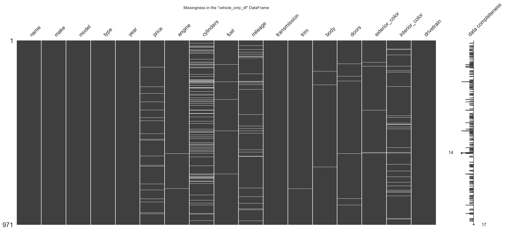
    


## Treatment of Missing Values
**Variables with Missing Values**:
- `price`: 23 missing,
- `engine`: 2 missing,
- `cylinders`: 103 missing,
- `fuel`: 7 missing,
- `mileage`: 32 missing,
- `transmission`: 2 missing,
- `trim`: 1 missing,
- `body`: 3 missing,
- `doors`: 7 missing,
- `exterior_color`: 5 missing, and
- `interior_color`: 38 missing.

223 total missing values present in the dataset with a **Data Sparsity** of < 2%.

### `price` Variable - Missing Values
- 23 missing values


```python
##-- Visual inspection of price distribution between different makes.
sns.catplot(
    x='make', y='price',
    data=vehicle_only_df.dropna(), kind='box',
    aspect=5/2
)
plt.xticks(rotation=45)
plt.grid(True)
plt.title('Price Distribution Between Different Vehicle Make', y=1.03)
plt.show()
```


    
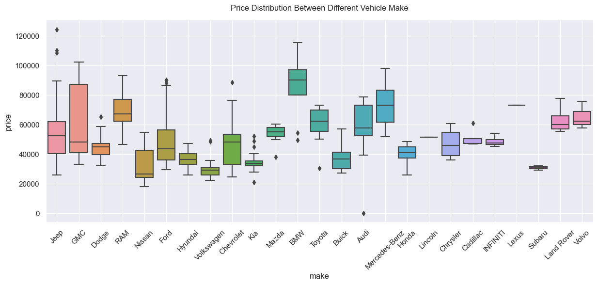
    


A glance at the distribution between different vehicle manufacturers reveals their price differences. Additionally, the distributions between different vehicle manufacturers are skewed, meaning that the best way to fill in missing values is to perform a median imputation based on `make` and `model`.

#### Impute missing values in the `price` column considering vehicle `make` and `model`.
1. Aggregate median values between make and model.
2. Create a loop to impute missing values for rows where make and model match.


```python
#-- Find median based on make and model
median_vals = vehicle_only_df.groupby(['make', 'model'])['price'].median().reset_index()
print(median_vals[median_vals['price'].isna()])  # Check for missing values in the df
median_vals
```

                  make    model  price
    9              BMW      530    NaN
    118  Mercedes-Benz  GLE 350    NaN
    


<div>
<style scoped>
    .dataframe tbody tr th:only-of-type {
        vertical-align: middle;
    }

    .dataframe tbody tr th {
        vertical-align: top;
    }

    .dataframe thead th {
        text-align: right;
    }
</style>
<table border="1" class="dataframe">
  <thead>
    <tr style="text-align: right;">
      <th></th>
      <th>make</th>
      <th>model</th>
      <th>price</th>
    </tr>
  </thead>
  <tbody>
    <tr>
      <th>0</th>
      <td>Acura</td>
      <td>MDX</td>
      <td>56155.0</td>
    </tr>
    <tr>
      <th>1</th>
      <td>Acura</td>
      <td>ZDX</td>
      <td>69850.0</td>
    </tr>
    <tr>
      <th>2</th>
      <td>Audi</td>
      <td>A3</td>
      <td>39375.0</td>
    </tr>
    <tr>
      <th>3</th>
      <td>Audi</td>
      <td>A5 Sportback</td>
      <td>56105.0</td>
    </tr>
    <tr>
      <th>4</th>
      <td>Audi</td>
      <td>Q5 e</td>
      <td>73190.0</td>
    </tr>
    <tr>
      <th>...</th>
      <td>...</td>
      <td>...</td>
      <td>...</td>
    </tr>
    <tr>
      <th>148</th>
      <td>Volkswagen</td>
      <td>Jetta</td>
      <td>25923.0</td>
    </tr>
    <tr>
      <th>149</th>
      <td>Volkswagen</td>
      <td>Taos</td>
      <td>29226.0</td>
    </tr>
    <tr>
      <th>150</th>
      <td>Volvo</td>
      <td>C40 Recharge Pure Electric</td>
      <td>62240.0</td>
    </tr>
    <tr>
      <th>151</th>
      <td>Volvo</td>
      <td>S60 Recharge Plug-In Hybrid</td>
      <td>57545.0</td>
    </tr>
    <tr>
      <th>152</th>
      <td>Volvo</td>
      <td>XC90 Recharge Plug-In Hybrid</td>
      <td>75595.0</td>
    </tr>
  </tbody>
</table>
<p>153 rows × 3 columns</p>
</div>


The dataset's `BMW 530` and the `Mercedes-Benz GLE 350` came up with missing values after aggregating the median value.
Values related to these vehicles will be dropped from the dataset, and all other missing values will be imputed using the `median_vals` DataFrame.


```python
##-- Drop defined rows, then impute median values --##
dropping_rows = vehicle_only_df[vehicle_only_df['model'].isin(['530', 'GLE 350'])]
vehicle_only_df.drop(dropping_rows.index, axis=0, inplace=True)


# Create a loop that imputes null values based on the vehicle model.
values = []
for i in range(vehicle_only_df.shape[0]):
    if pd.isnull(vehicle_only_df.iloc[i,5]):  # Checks if row is null on price variable
        m = vehicle_only_df.iloc[i,2]  # Extracts model name
        values.append(float(median_vals[median_vals['model']==m]['price']))  # append median value
    else:
        values.append(vehicle_only_df.iloc[i,5])  # append original price value

# Inspect missing values before and after imputation.
vehicle_only_df['price_check'] = values
print(vehicle_only_df[['price', 'price_check']].isna().sum())
```

    price          21
    price_check     0
    dtype: int64
    


```python
##-- replace 'price' with 'price_check' --##
vehicle_only_df['price'] = vehicle_only_df['price_check']
vehicle_only_df.drop('price_check', axis=1, inplace=True)
print(f"Total Missing values for 'price' variable: {vehicle_only_df['price'].isna().sum()}")
vehicle_only_df.head()
```

    Total Missing values for 'price' variable: 0
    


<div>
<style scoped>
    .dataframe tbody tr th:only-of-type {
        vertical-align: middle;
    }

    .dataframe tbody tr th {
        vertical-align: top;
    }

    .dataframe thead th {
        text-align: right;
    }
</style>
<table border="1" class="dataframe">
  <thead>
    <tr style="text-align: right;">
      <th></th>
      <th>name</th>
      <th>make</th>
      <th>model</th>
      <th>type</th>
      <th>year</th>
      <th>price</th>
      <th>engine</th>
      <th>cylinders</th>
      <th>fuel</th>
      <th>mileage</th>
      <th>transmission</th>
      <th>trim</th>
      <th>body</th>
      <th>doors</th>
      <th>exterior_color</th>
      <th>interior_color</th>
      <th>drivetrain</th>
    </tr>
  </thead>
  <tbody>
    <tr>
      <th>0</th>
      <td>2024 Jeep Wagoneer Series II</td>
      <td>Jeep</td>
      <td>Wagoneer</td>
      <td>New</td>
      <td>2024</td>
      <td>74600.0</td>
      <td>24V GDI DOHC Twin Turbo</td>
      <td>6.0</td>
      <td>Gasoline</td>
      <td>10.0</td>
      <td>8-Speed Automatic</td>
      <td>Series II</td>
      <td>SUV</td>
      <td>4.0</td>
      <td>White</td>
      <td>Global Black</td>
      <td>Four-wheel Drive</td>
    </tr>
    <tr>
      <th>1</th>
      <td>2024 Jeep Grand Cherokee Laredo</td>
      <td>Jeep</td>
      <td>Grand Cherokee</td>
      <td>New</td>
      <td>2024</td>
      <td>50170.0</td>
      <td>OHV</td>
      <td>6.0</td>
      <td>Gasoline</td>
      <td>1.0</td>
      <td>8-Speed Automatic</td>
      <td>Laredo</td>
      <td>SUV</td>
      <td>4.0</td>
      <td>Metallic</td>
      <td>Global Black</td>
      <td>Four-wheel Drive</td>
    </tr>
    <tr>
      <th>2</th>
      <td>2024 GMC Yukon XL Denali</td>
      <td>GMC</td>
      <td>Yukon XL</td>
      <td>New</td>
      <td>2024</td>
      <td>96410.0</td>
      <td>6.2L V-8 gasoline direct injection, variable v...</td>
      <td>8.0</td>
      <td>Gasoline</td>
      <td>0.0</td>
      <td>Automatic</td>
      <td>Denali</td>
      <td>SUV</td>
      <td>4.0</td>
      <td>Summit White</td>
      <td>Teak/Light Shale</td>
      <td>Four-wheel Drive</td>
    </tr>
    <tr>
      <th>3</th>
      <td>2023 Dodge Durango Pursuit</td>
      <td>Dodge</td>
      <td>Durango</td>
      <td>New</td>
      <td>2023</td>
      <td>46835.0</td>
      <td>16V MPFI OHV</td>
      <td>8.0</td>
      <td>Gasoline</td>
      <td>32.0</td>
      <td>8-Speed Automatic</td>
      <td>Pursuit</td>
      <td>SUV</td>
      <td>4.0</td>
      <td>White Knuckle Clearcoat</td>
      <td>Black</td>
      <td>All-wheel Drive</td>
    </tr>
    <tr>
      <th>4</th>
      <td>2024 RAM 3500 Laramie</td>
      <td>RAM</td>
      <td>3500</td>
      <td>New</td>
      <td>2024</td>
      <td>81663.0</td>
      <td>24V DDI OHV Turbo Diesel</td>
      <td>6.0</td>
      <td>Diesel</td>
      <td>10.0</td>
      <td>6-Speed Automatic</td>
      <td>Laramie</td>
      <td>Pickup Truck</td>
      <td>4.0</td>
      <td>Silver</td>
      <td>Black</td>
      <td>Four-wheel Drive</td>
    </tr>
  </tbody>
</table>
</div>


### `engine` Variable - Missing Values
- 2 missing values.


```python
##-- Glance at 2 rows with missing values in the `engine` column --##
vehicle_only_df[vehicle_only_df['engine'].isna()]
```


<div>
<style scoped>
    .dataframe tbody tr th:only-of-type {
        vertical-align: middle;
    }

    .dataframe tbody tr th {
        vertical-align: top;
    }

    .dataframe thead th {
        text-align: right;
    }
</style>
<table border="1" class="dataframe">
  <thead>
    <tr style="text-align: right;">
      <th></th>
      <th>name</th>
      <th>make</th>
      <th>model</th>
      <th>type</th>
      <th>year</th>
      <th>price</th>
      <th>engine</th>
      <th>cylinders</th>
      <th>fuel</th>
      <th>mileage</th>
      <th>transmission</th>
      <th>trim</th>
      <th>body</th>
      <th>doors</th>
      <th>exterior_color</th>
      <th>interior_color</th>
      <th>drivetrain</th>
    </tr>
  </thead>
  <tbody>
    <tr>
      <th>614</th>
      <td>2025 Honda CR-V Hybrid Sport Touring</td>
      <td>Honda</td>
      <td>CR-V Hybrid</td>
      <td>New</td>
      <td>2025</td>
      <td>42150.0</td>
      <td>NaN</td>
      <td>4.0</td>
      <td>Gasoline</td>
      <td>1.0</td>
      <td>1-Speed CVT with Overdrive</td>
      <td>Sport Touring</td>
      <td>SUV</td>
      <td>NaN</td>
      <td>Canyon</td>
      <td>Black</td>
      <td>All-wheel Drive</td>
    </tr>
    <tr>
      <th>803</th>
      <td>2024 Jeep Wagoneer Series II</td>
      <td>Jeep</td>
      <td>Wagoneer</td>
      <td>New</td>
      <td>2024</td>
      <td>73999.0</td>
      <td>NaN</td>
      <td>6.0</td>
      <td>Gasoline</td>
      <td>59.0</td>
      <td>8-Speed Automatic</td>
      <td>Series II</td>
      <td>SUV</td>
      <td>4.0</td>
      <td>Bright White Clearcoat</td>
      <td>Black</td>
      <td>Four-wheel Drive</td>
    </tr>
  </tbody>
</table>
</div>


Each row might have similar rows to extract the engine variable from.
We can inspect further:
- Model: `CR-V Hybrid`, and
- Model: `Wagoneer`.


```python
# Subsetting for model 'CR-V Hybrid'
vehicle_only_df[vehicle_only_df['model'] == 'CR-V Hybrid']
```


<div>
<style scoped>
    .dataframe tbody tr th:only-of-type {
        vertical-align: middle;
    }

    .dataframe tbody tr th {
        vertical-align: top;
    }

    .dataframe thead th {
        text-align: right;
    }
</style>
<table border="1" class="dataframe">
  <thead>
    <tr style="text-align: right;">
      <th></th>
      <th>name</th>
      <th>make</th>
      <th>model</th>
      <th>type</th>
      <th>year</th>
      <th>price</th>
      <th>engine</th>
      <th>cylinders</th>
      <th>fuel</th>
      <th>mileage</th>
      <th>transmission</th>
      <th>trim</th>
      <th>body</th>
      <th>doors</th>
      <th>exterior_color</th>
      <th>interior_color</th>
      <th>drivetrain</th>
    </tr>
  </thead>
  <tbody>
    <tr>
      <th>109</th>
      <td>2024 Honda CR-V Hybrid Sport Touring</td>
      <td>Honda</td>
      <td>CR-V Hybrid</td>
      <td>New</td>
      <td>2024</td>
      <td>42005.0</td>
      <td>16V GDI DOHC Hybrid</td>
      <td>4.0</td>
      <td>Hybrid</td>
      <td>1.0</td>
      <td>Automatic CVT</td>
      <td>Sport Touring</td>
      <td>SUV</td>
      <td>4.0</td>
      <td>Radiant Red Metallic</td>
      <td>Black</td>
      <td>All-wheel Drive</td>
    </tr>
    <tr>
      <th>304</th>
      <td>2024 Honda CR-V Hybrid Sport</td>
      <td>Honda</td>
      <td>CR-V Hybrid</td>
      <td>New</td>
      <td>2024</td>
      <td>36900.0</td>
      <td>16V GDI DOHC Hybrid</td>
      <td>4.0</td>
      <td>Hybrid</td>
      <td>1.0</td>
      <td>Automatic CVT</td>
      <td>Sport</td>
      <td>SUV</td>
      <td>4.0</td>
      <td>Lunar Silver Metallic</td>
      <td>Black</td>
      <td>All-wheel Drive</td>
    </tr>
    <tr>
      <th>534</th>
      <td>2024 Honda CR-V Hybrid Sport-L</td>
      <td>Honda</td>
      <td>CR-V Hybrid</td>
      <td>New</td>
      <td>2024</td>
      <td>40355.0</td>
      <td>16V GDI DOHC Hybrid</td>
      <td>4.0</td>
      <td>Hybrid</td>
      <td>68.0</td>
      <td>Automatic CVT</td>
      <td>Sport-L</td>
      <td>SUV</td>
      <td>4.0</td>
      <td>Platinum White Pearl</td>
      <td>Black</td>
      <td>All-wheel Drive</td>
    </tr>
    <tr>
      <th>614</th>
      <td>2025 Honda CR-V Hybrid Sport Touring</td>
      <td>Honda</td>
      <td>CR-V Hybrid</td>
      <td>New</td>
      <td>2025</td>
      <td>42150.0</td>
      <td>NaN</td>
      <td>4.0</td>
      <td>Gasoline</td>
      <td>1.0</td>
      <td>1-Speed CVT with Overdrive</td>
      <td>Sport Touring</td>
      <td>SUV</td>
      <td>NaN</td>
      <td>Canyon</td>
      <td>Black</td>
      <td>All-wheel Drive</td>
    </tr>
    <tr>
      <th>673</th>
      <td>2024 Honda CR-V Hybrid Sport-L</td>
      <td>Honda</td>
      <td>CR-V Hybrid</td>
      <td>New</td>
      <td>2024</td>
      <td>37505.0</td>
      <td>16V GDI DOHC Hybrid</td>
      <td>4.0</td>
      <td>Hybrid</td>
      <td>0.0</td>
      <td>Automatic CVT</td>
      <td>Sport-L</td>
      <td>SUV</td>
      <td>4.0</td>
      <td>Platinum White Pearl</td>
      <td>NaN</td>
      <td>Front-wheel Drive</td>
    </tr>
  </tbody>
</table>
</div>


```python
# Subsetting for model 'Wagoneer'
vehicle_only_df[vehicle_only_df['model'] == 'Wagoneer']
```


<div>
<style scoped>
    .dataframe tbody tr th:only-of-type {
        vertical-align: middle;
    }

    .dataframe tbody tr th {
        vertical-align: top;
    }

    .dataframe thead th {
        text-align: right;
    }
</style>
<table border="1" class="dataframe">
  <thead>
    <tr style="text-align: right;">
      <th></th>
      <th>name</th>
      <th>make</th>
      <th>model</th>
      <th>type</th>
      <th>year</th>
      <th>price</th>
      <th>engine</th>
      <th>cylinders</th>
      <th>fuel</th>
      <th>mileage</th>
      <th>transmission</th>
      <th>trim</th>
      <th>body</th>
      <th>doors</th>
      <th>exterior_color</th>
      <th>interior_color</th>
      <th>drivetrain</th>
    </tr>
  </thead>
  <tbody>
    <tr>
      <th>0</th>
      <td>2024 Jeep Wagoneer Series II</td>
      <td>Jeep</td>
      <td>Wagoneer</td>
      <td>New</td>
      <td>2024</td>
      <td>74600.0</td>
      <td>24V GDI DOHC Twin Turbo</td>
      <td>6.0</td>
      <td>Gasoline</td>
      <td>10.0</td>
      <td>8-Speed Automatic</td>
      <td>Series II</td>
      <td>SUV</td>
      <td>4.0</td>
      <td>White</td>
      <td>Global Black</td>
      <td>Four-wheel Drive</td>
    </tr>
    <tr>
      <th>6</th>
      <td>2024 Jeep Wagoneer Base</td>
      <td>Jeep</td>
      <td>Wagoneer</td>
      <td>New</td>
      <td>2024</td>
      <td>63862.0</td>
      <td>24V GDI DOHC Twin Turbo</td>
      <td>6.0</td>
      <td>Gasoline</td>
      <td>5.0</td>
      <td>8-Speed Automatic</td>
      <td>Base</td>
      <td>SUV</td>
      <td>4.0</td>
      <td>Bright White Clearcoat</td>
      <td>Black</td>
      <td>Rear-wheel Drive</td>
    </tr>
    <tr>
      <th>73</th>
      <td>2024 Jeep Wagoneer Base</td>
      <td>Jeep</td>
      <td>Wagoneer</td>
      <td>New</td>
      <td>2024</td>
      <td>63057.0</td>
      <td>24V GDI DOHC Twin Turbo</td>
      <td>6.0</td>
      <td>Gasoline</td>
      <td>NaN</td>
      <td>8-Speed Automatic</td>
      <td>Base</td>
      <td>SUV</td>
      <td>4.0</td>
      <td>Metallic</td>
      <td>Black</td>
      <td>Four-wheel Drive</td>
    </tr>
    <tr>
      <th>92</th>
      <td>2024 Jeep Wagoneer Base</td>
      <td>Jeep</td>
      <td>Wagoneer</td>
      <td>New</td>
      <td>2024</td>
      <td>60555.0</td>
      <td>24V GDI DOHC Twin Turbo</td>
      <td>6.0</td>
      <td>Gasoline</td>
      <td>5.0</td>
      <td>8-Speed Automatic</td>
      <td>Base</td>
      <td>SUV</td>
      <td>4.0</td>
      <td>Diamond Black</td>
      <td>Black</td>
      <td>Rear-wheel Drive</td>
    </tr>
    <tr>
      <th>234</th>
      <td>2024 Jeep Wagoneer Base</td>
      <td>Jeep</td>
      <td>Wagoneer</td>
      <td>New</td>
      <td>2024</td>
      <td>65928.0</td>
      <td>24V GDI DOHC Twin Turbo</td>
      <td>6.0</td>
      <td>Gasoline</td>
      <td>NaN</td>
      <td>8-Speed Automatic</td>
      <td>Base</td>
      <td>SUV</td>
      <td>4.0</td>
      <td>Bright White Clearcoat</td>
      <td>Black</td>
      <td>Four-wheel Drive</td>
    </tr>
    <tr>
      <th>250</th>
      <td>2024 Jeep Wagoneer Series II</td>
      <td>Jeep</td>
      <td>Wagoneer</td>
      <td>New</td>
      <td>2024</td>
      <td>87488.0</td>
      <td>24V GDI DOHC Twin Turbo</td>
      <td>6.0</td>
      <td>Gasoline</td>
      <td>22.0</td>
      <td>8-Speed Automatic</td>
      <td>Series II</td>
      <td>SUV</td>
      <td>4.0</td>
      <td>Riverrock Green</td>
      <td>Global Black</td>
      <td>Four-wheel Drive</td>
    </tr>
    <tr>
      <th>261</th>
      <td>2024 Jeep Wagoneer Series II</td>
      <td>Jeep</td>
      <td>Wagoneer</td>
      <td>New</td>
      <td>2024</td>
      <td>72908.0</td>
      <td>24V GDI DOHC Twin Turbo</td>
      <td>6.0</td>
      <td>Gasoline</td>
      <td>NaN</td>
      <td>8-Speed Automatic</td>
      <td>Series II</td>
      <td>SUV</td>
      <td>4.0</td>
      <td>Diamond Black</td>
      <td>Black</td>
      <td>Four-wheel Drive</td>
    </tr>
    <tr>
      <th>399</th>
      <td>2024 Jeep Wagoneer Series II</td>
      <td>Jeep</td>
      <td>Wagoneer</td>
      <td>New</td>
      <td>2024</td>
      <td>75888.0</td>
      <td>24V GDI DOHC Twin Turbo</td>
      <td>6.0</td>
      <td>Gasoline</td>
      <td>NaN</td>
      <td>8-Speed Automatic</td>
      <td>Series II</td>
      <td>SUV</td>
      <td>4.0</td>
      <td>Riverrock Green</td>
      <td>Black</td>
      <td>Four-wheel Drive</td>
    </tr>
    <tr>
      <th>650</th>
      <td>2024 Jeep Wagoneer Series II</td>
      <td>Jeep</td>
      <td>Wagoneer</td>
      <td>New</td>
      <td>2024</td>
      <td>84935.0</td>
      <td>24V GDI DOHC Twin Turbo</td>
      <td>6.0</td>
      <td>Gasoline</td>
      <td>1.0</td>
      <td>8-Speed Automatic</td>
      <td>Series II</td>
      <td>SUV</td>
      <td>4.0</td>
      <td>Velvet Red Pearlcoat</td>
      <td>Global Black</td>
      <td>Four-wheel Drive</td>
    </tr>
    <tr>
      <th>686</th>
      <td>2024 Jeep Wagoneer Base</td>
      <td>Jeep</td>
      <td>Wagoneer</td>
      <td>New</td>
      <td>2024</td>
      <td>77473.0</td>
      <td>24V GDI DOHC Twin Turbo</td>
      <td>6.0</td>
      <td>Gasoline</td>
      <td>14.0</td>
      <td>8-Speed Automatic</td>
      <td>Base</td>
      <td>SUV</td>
      <td>4.0</td>
      <td>Silver Zynith</td>
      <td>Global Black</td>
      <td>Four-wheel Drive</td>
    </tr>
    <tr>
      <th>751</th>
      <td>2024 Jeep Wagoneer Series III</td>
      <td>Jeep</td>
      <td>Wagoneer</td>
      <td>New</td>
      <td>2024</td>
      <td>89595.0</td>
      <td>24V GDI DOHC Twin Turbo</td>
      <td>6.0</td>
      <td>Gasoline</td>
      <td>1.0</td>
      <td>8-Speed Automatic</td>
      <td>Series III</td>
      <td>SUV</td>
      <td>4.0</td>
      <td>Bright White Clearcoat</td>
      <td>Global Black</td>
      <td>Four-wheel Drive</td>
    </tr>
    <tr>
      <th>772</th>
      <td>2024 Jeep Wagoneer Series II</td>
      <td>Jeep</td>
      <td>Wagoneer</td>
      <td>New</td>
      <td>2024</td>
      <td>79487.0</td>
      <td>24V GDI DOHC Twin Turbo</td>
      <td>6.0</td>
      <td>Gasoline</td>
      <td>18.0</td>
      <td>8-Speed Automatic</td>
      <td>Series II</td>
      <td>SUV</td>
      <td>4.0</td>
      <td>Riverrock Green</td>
      <td>Black</td>
      <td>Four-wheel Drive</td>
    </tr>
    <tr>
      <th>803</th>
      <td>2024 Jeep Wagoneer Series II</td>
      <td>Jeep</td>
      <td>Wagoneer</td>
      <td>New</td>
      <td>2024</td>
      <td>73999.0</td>
      <td>NaN</td>
      <td>6.0</td>
      <td>Gasoline</td>
      <td>59.0</td>
      <td>8-Speed Automatic</td>
      <td>Series II</td>
      <td>SUV</td>
      <td>4.0</td>
      <td>Bright White Clearcoat</td>
      <td>Black</td>
      <td>Four-wheel Drive</td>
    </tr>
    <tr>
      <th>837</th>
      <td>2024 Jeep Wagoneer Base</td>
      <td>Jeep</td>
      <td>Wagoneer</td>
      <td>New</td>
      <td>2024</td>
      <td>64434.0</td>
      <td>rbo Regular Unleaded I-6 3.0 L/183</td>
      <td>6.0</td>
      <td>Gasoline</td>
      <td>20.0</td>
      <td>Automatic</td>
      <td>Base</td>
      <td>SUV</td>
      <td>4.0</td>
      <td>Diamond Black Crystal Pearlcoat</td>
      <td>Black</td>
      <td>Four-wheel Drive</td>
    </tr>
    <tr>
      <th>970</th>
      <td>2024 Jeep Wagoneer Series II</td>
      <td>Jeep</td>
      <td>Wagoneer</td>
      <td>New</td>
      <td>2024</td>
      <td>74625.0</td>
      <td>24V GDI DOHC Twin Turbo</td>
      <td>6.0</td>
      <td>Gasoline</td>
      <td>10.0</td>
      <td>8-Speed Automatic</td>
      <td>Series II</td>
      <td>SUV</td>
      <td>4.0</td>
      <td>Silver</td>
      <td>Global Black</td>
      <td>Four-wheel Drive</td>
    </tr>
    <tr>
      <th>999</th>
      <td>2024 Jeep Wagoneer Base</td>
      <td>Jeep</td>
      <td>Wagoneer</td>
      <td>New</td>
      <td>2024</td>
      <td>69085.0</td>
      <td>24V GDI DOHC Twin Turbo</td>
      <td>6.0</td>
      <td>Gasoline</td>
      <td>20.0</td>
      <td>8-Speed Automatic</td>
      <td>Base</td>
      <td>SUV</td>
      <td>4.0</td>
      <td>Diamond Black</td>
      <td>Black</td>
      <td>Four-wheel Drive</td>
    </tr>
  </tbody>
</table>
</div>


#### Impute using the forward fill method.
Upon quick inspection, sorting the DataFrame by `model` and `engine` will allow the use of the forward fill method to fill in missing values.


```python
##-- Sort and ffill --##
vehicle_only_df.sort_values(['model', 'engine'], ascending=False, inplace=True)
vehicle_only_df['engine'].fillna(method='ffill', inplace=True)

print(f"Total Missing Values in 'engine' column: {vehicle_only_df['engine'].isna().sum()}")
print(vehicle_only_df[vehicle_only_df['model'] == 'CR-V Hybrid'][['model', 'engine']])
print(vehicle_only_df[vehicle_only_df['model'] == 'Wagoneer'][['model', 'engine']])
```

    Total Missing Values in 'engine' column: 0
               model               engine
    109  CR-V Hybrid  16V GDI DOHC Hybrid
    304  CR-V Hybrid  16V GDI DOHC Hybrid
    534  CR-V Hybrid  16V GDI DOHC Hybrid
    673  CR-V Hybrid  16V GDI DOHC Hybrid
    614  CR-V Hybrid  16V GDI DOHC Hybrid
            model                              engine
    837  Wagoneer  rbo Regular Unleaded I-6 3.0 L/183
    0    Wagoneer             24V GDI DOHC Twin Turbo
    6    Wagoneer             24V GDI DOHC Twin Turbo
    73   Wagoneer             24V GDI DOHC Twin Turbo
    92   Wagoneer             24V GDI DOHC Twin Turbo
    234  Wagoneer             24V GDI DOHC Twin Turbo
    250  Wagoneer             24V GDI DOHC Twin Turbo
    261  Wagoneer             24V GDI DOHC Twin Turbo
    399  Wagoneer             24V GDI DOHC Twin Turbo
    650  Wagoneer             24V GDI DOHC Twin Turbo
    686  Wagoneer             24V GDI DOHC Twin Turbo
    751  Wagoneer             24V GDI DOHC Twin Turbo
    772  Wagoneer             24V GDI DOHC Twin Turbo
    970  Wagoneer             24V GDI DOHC Twin Turbo
    999  Wagoneer             24V GDI DOHC Twin Turbo
    803  Wagoneer             24V GDI DOHC Twin Turbo
    

### `cylinders` variable - Missing Values
- 103 missing values


```python
print(f"Total Missing Values in `cylinders` column: {vehicle_only_df['cylinders'].isna().sum()}")

##- Inspect rows where Cylinders has a missing value --##
vehicle_only_df[vehicle_only_df['cylinders'].isna()]
```

    Total Missing Values in `cylinders` column: 103
    


<div>
<style scoped>
    .dataframe tbody tr th:only-of-type {
        vertical-align: middle;
    }

    .dataframe tbody tr th {
        vertical-align: top;
    }

    .dataframe thead th {
        text-align: right;
    }
</style>
<table border="1" class="dataframe">
  <thead>
    <tr style="text-align: right;">
      <th></th>
      <th>name</th>
      <th>make</th>
      <th>model</th>
      <th>type</th>
      <th>year</th>
      <th>price</th>
      <th>engine</th>
      <th>cylinders</th>
      <th>fuel</th>
      <th>mileage</th>
      <th>transmission</th>
      <th>trim</th>
      <th>body</th>
      <th>doors</th>
      <th>exterior_color</th>
      <th>interior_color</th>
      <th>drivetrain</th>
    </tr>
  </thead>
  <tbody>
    <tr>
      <th>293</th>
      <td>2024 BMW i7 eDrive50</td>
      <td>BMW</td>
      <td>i7</td>
      <td>New</td>
      <td>2024</td>
      <td>110445.0</td>
      <td>c</td>
      <td>NaN</td>
      <td>Electric</td>
      <td>5.0</td>
      <td>1-Speed Automatic</td>
      <td>eDrive50</td>
      <td>Sedan</td>
      <td>4.0</td>
      <td>Black Sapphire Metallic</td>
      <td>Black</td>
      <td>Rear-wheel Drive</td>
    </tr>
    <tr>
      <th>884</th>
      <td>2024 BMW i7 M70</td>
      <td>BMW</td>
      <td>i7</td>
      <td>New</td>
      <td>2024</td>
      <td>195895.0</td>
      <td>c</td>
      <td>NaN</td>
      <td>Electric</td>
      <td>0.0</td>
      <td>1-Speed Automatic</td>
      <td>M70</td>
      <td>Sedan</td>
      <td>4.0</td>
      <td>Gray Metallic</td>
      <td>Caramel</td>
      <td>All-wheel Drive</td>
    </tr>
    <tr>
      <th>227</th>
      <td>2024 BMW i5 M60</td>
      <td>BMW</td>
      <td>i5</td>
      <td>New</td>
      <td>2024</td>
      <td>91825.0</td>
      <td>c</td>
      <td>NaN</td>
      <td>Electric</td>
      <td>7.0</td>
      <td>1-Speed Automatic</td>
      <td>M60</td>
      <td>Sedan</td>
      <td>4.0</td>
      <td>Mineral White</td>
      <td>Black</td>
      <td>All-wheel Drive</td>
    </tr>
    <tr>
      <th>419</th>
      <td>2024 BMW i5 M60</td>
      <td>BMW</td>
      <td>i5</td>
      <td>New</td>
      <td>2024</td>
      <td>96895.0</td>
      <td>c</td>
      <td>NaN</td>
      <td>Electric</td>
      <td>37.0</td>
      <td>1-Speed Automatic</td>
      <td>M60</td>
      <td>Sedan</td>
      <td>4.0</td>
      <td>Black Sapphire</td>
      <td>Black</td>
      <td>All-wheel Drive</td>
    </tr>
    <tr>
      <th>424</th>
      <td>2024 BMW i5 M60</td>
      <td>BMW</td>
      <td>i5</td>
      <td>New</td>
      <td>2024</td>
      <td>93335.0</td>
      <td>c</td>
      <td>NaN</td>
      <td>Electric</td>
      <td>3.0</td>
      <td>1-Speed Automatic</td>
      <td>M60</td>
      <td>Sedan</td>
      <td>4.0</td>
      <td>Black Sapphire</td>
      <td>Black</td>
      <td>All-wheel Drive</td>
    </tr>
    <tr>
      <th>...</th>
      <td>...</td>
      <td>...</td>
      <td>...</td>
      <td>...</td>
      <td>...</td>
      <td>...</td>
      <td>...</td>
      <td>...</td>
      <td>...</td>
      <td>...</td>
      <td>...</td>
      <td>...</td>
      <td>...</td>
      <td>...</td>
      <td>...</td>
      <td>...</td>
      <td>...</td>
    </tr>
    <tr>
      <th>121</th>
      <td>2024 Mercedes-Benz EQE 350+ Base</td>
      <td>Mercedes-Benz</td>
      <td>EQE 350+</td>
      <td>New</td>
      <td>2024</td>
      <td>79765.0</td>
      <td>c</td>
      <td>NaN</td>
      <td>Electric</td>
      <td>9.0</td>
      <td>1-Speed Automatic</td>
      <td>Base</td>
      <td>Sedan</td>
      <td>4.0</td>
      <td>Twilight Blue Metallic</td>
      <td>Gray</td>
      <td>Rear-wheel Drive</td>
    </tr>
    <tr>
      <th>893</th>
      <td>2025 Honda CR-V EX-L</td>
      <td>Honda</td>
      <td>CR-V</td>
      <td>New</td>
      <td>2025</td>
      <td>38305.0</td>
      <td>d&gt;\n\n    \n    &lt;dt&gt;VIN&lt;/dt&gt;\n     7FARS4H71SE...</td>
      <td>NaN</td>
      <td>Gasoline</td>
      <td>0.0</td>
      <td>Automatic CVT</td>
      <td>EX-L</td>
      <td>SUV</td>
      <td>NaN</td>
      <td>Urban Gray Pearl</td>
      <td>Black</td>
      <td>All-wheel Drive</td>
    </tr>
    <tr>
      <th>14</th>
      <td>2024 Chevrolet Blazer EV 2LT</td>
      <td>Chevrolet</td>
      <td>Blazer EV</td>
      <td>New</td>
      <td>2024</td>
      <td>51695.0</td>
      <td>c</td>
      <td>NaN</td>
      <td>Electric</td>
      <td>4.0</td>
      <td>1-Speed Automatic</td>
      <td>2LT</td>
      <td>SUV</td>
      <td>4.0</td>
      <td>Sterling Gray Metallic</td>
      <td>Black</td>
      <td>All-wheel Drive</td>
    </tr>
    <tr>
      <th>28</th>
      <td>2024 Chevrolet Blazer EV 2LT</td>
      <td>Chevrolet</td>
      <td>Blazer EV</td>
      <td>New</td>
      <td>2024</td>
      <td>52190.0</td>
      <td>c</td>
      <td>NaN</td>
      <td>Electric</td>
      <td>6.0</td>
      <td>1-Speed Automatic</td>
      <td>2LT</td>
      <td>SUV</td>
      <td>4.0</td>
      <td>Radiant Red</td>
      <td>Black</td>
      <td>All-wheel Drive</td>
    </tr>
    <tr>
      <th>252</th>
      <td>2024 Chevrolet Blazer EV RS</td>
      <td>Chevrolet</td>
      <td>Blazer EV</td>
      <td>New</td>
      <td>2024</td>
      <td>55090.0</td>
      <td>c</td>
      <td>NaN</td>
      <td>Electric</td>
      <td>9.0</td>
      <td>1-Speed Automatic</td>
      <td>RS</td>
      <td>SUV</td>
      <td>4.0</td>
      <td>Radiant Red</td>
      <td>Black</td>
      <td>All-wheel Drive</td>
    </tr>
  </tbody>
</table>
<p>103 rows × 17 columns</p>
</div>


- At first glance, vehicles that are EVs, where the fuel variable equals `Electric`, show to have missing values in the cylinders variable.
- There seems to be more missing values where fuel is different than `Electric`.


```python
##-- Subset rows based on missing values in the cylinder column, but fuel is not `Electric` Value. --##
vehicle_only_df[(vehicle_only_df['cylinders'].isna()) & (vehicle_only_df['fuel'] != 'Electric')]
```


<div>
<style scoped>
    .dataframe tbody tr th:only-of-type {
        vertical-align: middle;
    }

    .dataframe tbody tr th {
        vertical-align: top;
    }

    .dataframe thead th {
        text-align: right;
    }
</style>
<table border="1" class="dataframe">
  <thead>
    <tr style="text-align: right;">
      <th></th>
      <th>name</th>
      <th>make</th>
      <th>model</th>
      <th>type</th>
      <th>year</th>
      <th>price</th>
      <th>engine</th>
      <th>cylinders</th>
      <th>fuel</th>
      <th>mileage</th>
      <th>transmission</th>
      <th>trim</th>
      <th>body</th>
      <th>doors</th>
      <th>exterior_color</th>
      <th>interior_color</th>
      <th>drivetrain</th>
    </tr>
  </thead>
  <tbody>
    <tr>
      <th>128</th>
      <td>2024 Subaru Solterra Premium</td>
      <td>Subaru</td>
      <td>Solterra</td>
      <td>New</td>
      <td>2024</td>
      <td>39934.0</td>
      <td>c</td>
      <td>NaN</td>
      <td>NaN</td>
      <td>5.0</td>
      <td>1-Speed Automatic</td>
      <td>Premium</td>
      <td>SUV</td>
      <td>4.0</td>
      <td>Galactic</td>
      <td>Black</td>
      <td>All-wheel Drive</td>
    </tr>
    <tr>
      <th>219</th>
      <td>2024 Honda Prologue TOURING</td>
      <td>Honda</td>
      <td>Prologue</td>
      <td>New</td>
      <td>2024</td>
      <td>55800.0</td>
      <td>c</td>
      <td>NaN</td>
      <td>NaN</td>
      <td>NaN</td>
      <td>1-Speed Automatic</td>
      <td>TOURING</td>
      <td>SUV</td>
      <td>4.0</td>
      <td>BX</td>
      <td>Gray</td>
      <td>All-wheel Drive</td>
    </tr>
    <tr>
      <th>315</th>
      <td>2024 Honda Prologue TOURING</td>
      <td>Honda</td>
      <td>Prologue</td>
      <td>New</td>
      <td>2024</td>
      <td>56550.0</td>
      <td>c</td>
      <td>NaN</td>
      <td>NaN</td>
      <td>1.0</td>
      <td>1-Speed Automatic</td>
      <td>TOURING</td>
      <td>SUV</td>
      <td>4.0</td>
      <td>Gray</td>
      <td>Black</td>
      <td>All-wheel Drive</td>
    </tr>
    <tr>
      <th>489</th>
      <td>2024 Honda Prologue TOURING</td>
      <td>Honda</td>
      <td>Prologue</td>
      <td>New</td>
      <td>2024</td>
      <td>55800.0</td>
      <td>c</td>
      <td>NaN</td>
      <td>NaN</td>
      <td>NaN</td>
      <td>1-Speed Automatic</td>
      <td>TOURING</td>
      <td>SUV</td>
      <td>4.0</td>
      <td>Pearl</td>
      <td>Black</td>
      <td>All-wheel Drive</td>
    </tr>
    <tr>
      <th>490</th>
      <td>2024 Honda Prologue TOURING</td>
      <td>Honda</td>
      <td>Prologue</td>
      <td>New</td>
      <td>2024</td>
      <td>55800.0</td>
      <td>c</td>
      <td>NaN</td>
      <td>NaN</td>
      <td>NaN</td>
      <td>1-Speed Automatic</td>
      <td>TOURING</td>
      <td>SUV</td>
      <td>4.0</td>
      <td>Gray</td>
      <td>Black</td>
      <td>All-wheel Drive</td>
    </tr>
    <tr>
      <th>726</th>
      <td>2024 Jaguar I-PACE EV400 R-Dynamic HSE</td>
      <td>Jaguar</td>
      <td>I-PACE</td>
      <td>New</td>
      <td>2024</td>
      <td>77053.0</td>
      <td>d&gt;\n\n    \n    &lt;dt&gt;VIN&lt;/dt&gt;\n     SADHM2S12R1...</td>
      <td>NaN</td>
      <td>NaN</td>
      <td>8.0</td>
      <td>Automatic</td>
      <td>EV400 R-Dynamic HSE</td>
      <td>SUV</td>
      <td>5.0</td>
      <td>Santorini Black</td>
      <td>Ebony</td>
      <td>All-wheel Drive</td>
    </tr>
    <tr>
      <th>610</th>
      <td>2024 Chevrolet Equinox EV RS</td>
      <td>Chevrolet</td>
      <td>Equinox EV</td>
      <td>New</td>
      <td>2024</td>
      <td>47495.0</td>
      <td>&lt;dt&gt;VIN&lt;/dt&gt;\n     3GN7DNRPXRS232327</td>
      <td>NaN</td>
      <td>NaN</td>
      <td>0.0</td>
      <td>Automatic</td>
      <td>RS</td>
      <td>SUV</td>
      <td>NaN</td>
      <td>Sterling Gray Metallic</td>
      <td>Black</td>
      <td>Front-wheel Drive</td>
    </tr>
    <tr>
      <th>893</th>
      <td>2025 Honda CR-V EX-L</td>
      <td>Honda</td>
      <td>CR-V</td>
      <td>New</td>
      <td>2025</td>
      <td>38305.0</td>
      <td>d&gt;\n\n    \n    &lt;dt&gt;VIN&lt;/dt&gt;\n     7FARS4H71SE...</td>
      <td>NaN</td>
      <td>Gasoline</td>
      <td>0.0</td>
      <td>Automatic CVT</td>
      <td>EX-L</td>
      <td>SUV</td>
      <td>NaN</td>
      <td>Urban Gray Pearl</td>
      <td>Black</td>
      <td>All-wheel Drive</td>
    </tr>
  </tbody>
</table>
</div>


```python
##-- Subset for rows on defined model names --##
vehicle_only_df[vehicle_only_df['model'].isin([
    'Solterra', 'Prologue', 'I-PACE', 'Equinox EV', 'CR-V'
])][['make', 'model', 'cylinders', 'fuel']].sort_values('make')
```


<div>
<style scoped>
    .dataframe tbody tr th:only-of-type {
        vertical-align: middle;
    }

    .dataframe tbody tr th {
        vertical-align: top;
    }

    .dataframe thead th {
        text-align: right;
    }
</style>
<table border="1" class="dataframe">
  <thead>
    <tr style="text-align: right;">
      <th></th>
      <th>make</th>
      <th>model</th>
      <th>cylinders</th>
      <th>fuel</th>
    </tr>
  </thead>
  <tbody>
    <tr>
      <th>610</th>
      <td>Chevrolet</td>
      <td>Equinox EV</td>
      <td>NaN</td>
      <td>NaN</td>
    </tr>
    <tr>
      <th>219</th>
      <td>Honda</td>
      <td>Prologue</td>
      <td>NaN</td>
      <td>NaN</td>
    </tr>
    <tr>
      <th>315</th>
      <td>Honda</td>
      <td>Prologue</td>
      <td>NaN</td>
      <td>NaN</td>
    </tr>
    <tr>
      <th>489</th>
      <td>Honda</td>
      <td>Prologue</td>
      <td>NaN</td>
      <td>NaN</td>
    </tr>
    <tr>
      <th>490</th>
      <td>Honda</td>
      <td>Prologue</td>
      <td>NaN</td>
      <td>NaN</td>
    </tr>
    <tr>
      <th>257</th>
      <td>Honda</td>
      <td>CR-V</td>
      <td>4.0</td>
      <td>Hybrid</td>
    </tr>
    <tr>
      <th>893</th>
      <td>Honda</td>
      <td>CR-V</td>
      <td>NaN</td>
      <td>Gasoline</td>
    </tr>
    <tr>
      <th>950</th>
      <td>Honda</td>
      <td>CR-V</td>
      <td>4.0</td>
      <td>Gasoline</td>
    </tr>
    <tr>
      <th>726</th>
      <td>Jaguar</td>
      <td>I-PACE</td>
      <td>NaN</td>
      <td>NaN</td>
    </tr>
    <tr>
      <th>128</th>
      <td>Subaru</td>
      <td>Solterra</td>
      <td>NaN</td>
      <td>NaN</td>
    </tr>
  </tbody>
</table>
</div>


- Judging by the model name, the Chevrolet Equinox EV is an Electric Fuel type.
- From the Honda website, the Honda Prologue is also an EV.
- Comparing the next similar row, the missing value for the Honda CR-V is the `4.0` cylinder, and the fuel is `Gasoline`.
- The Jaguar I-PACE is an EV.
- and the Subaru Solterra Premium is an EV.

#### Impute the cylinder column and some fuel columns.
1. Impute rows with a missing value in the cylinders column and a discrepancy in the fuel column.
2. Afterward, use the `.fillna()` function to fill the rest of the columns with the value of `0.0` to represent EVs. 


```python
##-- Fill missing value for CR-V
vehicle_only_df.loc[893, 'cylinders'] = 4.0

##-- Define rows that are supposed to be electric vehicles --##
rows = [
    128, 219, 315, 489, 490, 610, 726
]
for i in rows:
    vehicle_only_df.loc[i, 'cylinders'] = 0.0
    vehicle_only_df.loc[i, 'fuel'] = 'Electric'

# print rows to inspect
vehicle_only_df[vehicle_only_df['model'].isin([
    'Solterra', 'Prologue', 'I-PACE', 'Equinox EV', 'CR-V'
])][['make', 'model', 'cylinders', 'fuel']].sort_values('make')
```


<div>
<style scoped>
    .dataframe tbody tr th:only-of-type {
        vertical-align: middle;
    }

    .dataframe tbody tr th {
        vertical-align: top;
    }

    .dataframe thead th {
        text-align: right;
    }
</style>
<table border="1" class="dataframe">
  <thead>
    <tr style="text-align: right;">
      <th></th>
      <th>make</th>
      <th>model</th>
      <th>cylinders</th>
      <th>fuel</th>
    </tr>
  </thead>
  <tbody>
    <tr>
      <th>610</th>
      <td>Chevrolet</td>
      <td>Equinox EV</td>
      <td>0.0</td>
      <td>Electric</td>
    </tr>
    <tr>
      <th>219</th>
      <td>Honda</td>
      <td>Prologue</td>
      <td>0.0</td>
      <td>Electric</td>
    </tr>
    <tr>
      <th>315</th>
      <td>Honda</td>
      <td>Prologue</td>
      <td>0.0</td>
      <td>Electric</td>
    </tr>
    <tr>
      <th>489</th>
      <td>Honda</td>
      <td>Prologue</td>
      <td>0.0</td>
      <td>Electric</td>
    </tr>
    <tr>
      <th>490</th>
      <td>Honda</td>
      <td>Prologue</td>
      <td>0.0</td>
      <td>Electric</td>
    </tr>
    <tr>
      <th>257</th>
      <td>Honda</td>
      <td>CR-V</td>
      <td>4.0</td>
      <td>Hybrid</td>
    </tr>
    <tr>
      <th>893</th>
      <td>Honda</td>
      <td>CR-V</td>
      <td>4.0</td>
      <td>Gasoline</td>
    </tr>
    <tr>
      <th>950</th>
      <td>Honda</td>
      <td>CR-V</td>
      <td>4.0</td>
      <td>Gasoline</td>
    </tr>
    <tr>
      <th>726</th>
      <td>Jaguar</td>
      <td>I-PACE</td>
      <td>0.0</td>
      <td>Electric</td>
    </tr>
    <tr>
      <th>128</th>
      <td>Subaru</td>
      <td>Solterra</td>
      <td>0.0</td>
      <td>Electric</td>
    </tr>
  </tbody>
</table>
</div>


```python
##-- Fill remaining missing values in cylinders columns with 0.0 for EVs --##
vehicle_only_df['cylinders'].fillna(0.0, inplace=True)

print(f"Total Missing in `cylinders` Column: {vehicle_only_df['cylinders'].isna().sum()}")
```

    Total Missing in `cylinders` Column: 0
    

### `fuel` variable - Missing Values
- All 7 missing values were imputed from handling the `cylinders` column.


```python
##-- Count missing values in column. --##
print(f"Total Missing Values in `fuel` Column: {vehicle_only_df['fuel'].isna().sum()}")
```

    Total Missing Values in `fuel` Column: 0
    

### `mileage` variable - Missing Values


```python
##-- Missing value count in mileage variable --##
print(f"Total Missing Values in `mileage` Column: {vehicle_only_df['mileage'].isna().sum()}")

## Print summary statistics of mileage column.
print(vehicle_only_df['mileage'].describe())
## subset for rows with missing values in mileage column
vehicle_only_df[vehicle_only_df['mileage'].isna()].head(10)
```

    Total Missing Values in `mileage` Column: 32
    count     937.000000
    mean       70.919957
    std       515.657353
    min         0.000000
    25%         4.000000
    50%         8.000000
    75%        13.000000
    max      9711.000000
    Name: mileage, dtype: float64
    


<div>
<style scoped>
    .dataframe tbody tr th:only-of-type {
        vertical-align: middle;
    }

    .dataframe tbody tr th {
        vertical-align: top;
    }

    .dataframe thead th {
        text-align: right;
    }
</style>
<table border="1" class="dataframe">
  <thead>
    <tr style="text-align: right;">
      <th></th>
      <th>name</th>
      <th>make</th>
      <th>model</th>
      <th>type</th>
      <th>year</th>
      <th>price</th>
      <th>engine</th>
      <th>cylinders</th>
      <th>fuel</th>
      <th>mileage</th>
      <th>transmission</th>
      <th>trim</th>
      <th>body</th>
      <th>doors</th>
      <th>exterior_color</th>
      <th>interior_color</th>
      <th>drivetrain</th>
    </tr>
  </thead>
  <tbody>
    <tr>
      <th>217</th>
      <td>2024 Jeep Wrangler 4xe Sport</td>
      <td>Jeep</td>
      <td>Wrangler 4xe</td>
      <td>New</td>
      <td>2024</td>
      <td>50755.0</td>
      <td>16V GDI DOHC Turbo Hybrid</td>
      <td>4.0</td>
      <td>Hybrid</td>
      <td>NaN</td>
      <td>8-Speed Automatic</td>
      <td>Sport</td>
      <td>SUV</td>
      <td>4.0</td>
      <td>Bright White Clearcoat</td>
      <td>Black</td>
      <td>Four-wheel Drive</td>
    </tr>
    <tr>
      <th>594</th>
      <td>2024 Jeep Wrangler 4xe Sport</td>
      <td>Jeep</td>
      <td>Wrangler 4xe</td>
      <td>New</td>
      <td>2024</td>
      <td>51350.0</td>
      <td>16V GDI DOHC Turbo Hybrid</td>
      <td>4.0</td>
      <td>Hybrid</td>
      <td>NaN</td>
      <td>8-Speed Automatic</td>
      <td>Sport</td>
      <td>SUV</td>
      <td>4.0</td>
      <td>Anvil Clearcoat</td>
      <td>Black</td>
      <td>Four-wheel Drive</td>
    </tr>
    <tr>
      <th>596</th>
      <td>2023 Jeep Wrangler 4xe Sahara</td>
      <td>Jeep</td>
      <td>Wrangler 4xe</td>
      <td>New</td>
      <td>2023</td>
      <td>63715.0</td>
      <td>16V GDI DOHC Turbo Hybrid</td>
      <td>4.0</td>
      <td>Hybrid</td>
      <td>NaN</td>
      <td>8-Speed Automatic</td>
      <td>Sahara</td>
      <td>SUV</td>
      <td>4.0</td>
      <td>Silver Zynith Clearcoat</td>
      <td>Black</td>
      <td>Four-wheel Drive</td>
    </tr>
    <tr>
      <th>607</th>
      <td>2024 Jeep Wagoneer L Series II</td>
      <td>Jeep</td>
      <td>Wagoneer L</td>
      <td>New</td>
      <td>2024</td>
      <td>83845.0</td>
      <td>24V GDI DOHC Twin Turbo</td>
      <td>6.0</td>
      <td>Gasoline</td>
      <td>NaN</td>
      <td>8-Speed Automatic</td>
      <td>Series II</td>
      <td>SUV</td>
      <td>4.0</td>
      <td>Bright White Clearcoat</td>
      <td>Black</td>
      <td>Four-wheel Drive</td>
    </tr>
    <tr>
      <th>73</th>
      <td>2024 Jeep Wagoneer Base</td>
      <td>Jeep</td>
      <td>Wagoneer</td>
      <td>New</td>
      <td>2024</td>
      <td>63057.0</td>
      <td>24V GDI DOHC Twin Turbo</td>
      <td>6.0</td>
      <td>Gasoline</td>
      <td>NaN</td>
      <td>8-Speed Automatic</td>
      <td>Base</td>
      <td>SUV</td>
      <td>4.0</td>
      <td>Metallic</td>
      <td>Black</td>
      <td>Four-wheel Drive</td>
    </tr>
    <tr>
      <th>234</th>
      <td>2024 Jeep Wagoneer Base</td>
      <td>Jeep</td>
      <td>Wagoneer</td>
      <td>New</td>
      <td>2024</td>
      <td>65928.0</td>
      <td>24V GDI DOHC Twin Turbo</td>
      <td>6.0</td>
      <td>Gasoline</td>
      <td>NaN</td>
      <td>8-Speed Automatic</td>
      <td>Base</td>
      <td>SUV</td>
      <td>4.0</td>
      <td>Bright White Clearcoat</td>
      <td>Black</td>
      <td>Four-wheel Drive</td>
    </tr>
    <tr>
      <th>261</th>
      <td>2024 Jeep Wagoneer Series II</td>
      <td>Jeep</td>
      <td>Wagoneer</td>
      <td>New</td>
      <td>2024</td>
      <td>72908.0</td>
      <td>24V GDI DOHC Twin Turbo</td>
      <td>6.0</td>
      <td>Gasoline</td>
      <td>NaN</td>
      <td>8-Speed Automatic</td>
      <td>Series II</td>
      <td>SUV</td>
      <td>4.0</td>
      <td>Diamond Black</td>
      <td>Black</td>
      <td>Four-wheel Drive</td>
    </tr>
    <tr>
      <th>399</th>
      <td>2024 Jeep Wagoneer Series II</td>
      <td>Jeep</td>
      <td>Wagoneer</td>
      <td>New</td>
      <td>2024</td>
      <td>75888.0</td>
      <td>24V GDI DOHC Twin Turbo</td>
      <td>6.0</td>
      <td>Gasoline</td>
      <td>NaN</td>
      <td>8-Speed Automatic</td>
      <td>Series II</td>
      <td>SUV</td>
      <td>4.0</td>
      <td>Riverrock Green</td>
      <td>Black</td>
      <td>Four-wheel Drive</td>
    </tr>
    <tr>
      <th>885</th>
      <td>2024 Hyundai Tucson Hybrid SEL Convenience</td>
      <td>Hyundai</td>
      <td>Tucson Hybrid</td>
      <td>New</td>
      <td>2024</td>
      <td>37215.0</td>
      <td>16V GDI DOHC Turbo Hybrid</td>
      <td>4.0</td>
      <td>Hybrid</td>
      <td>NaN</td>
      <td>6-Speed Automatic</td>
      <td>SEL Convenience</td>
      <td>SUV</td>
      <td>4.0</td>
      <td>Black Pearl</td>
      <td>Gray</td>
      <td>All-wheel Drive</td>
    </tr>
    <tr>
      <th>225</th>
      <td>2024 Volkswagen Taos 1.5T S</td>
      <td>Volkswagen</td>
      <td>Taos</td>
      <td>New</td>
      <td>2024</td>
      <td>25895.0</td>
      <td>16V GDI DOHC Turbo</td>
      <td>4.0</td>
      <td>Gasoline</td>
      <td>NaN</td>
      <td>7-Speed DSGA? Automatic w/ 4MO</td>
      <td>1.5T S</td>
      <td>SUV</td>
      <td>4.0</td>
      <td>Deep Black Pearl Effect</td>
      <td>Black</td>
      <td>All-wheel Drive</td>
    </tr>
  </tbody>
</table>
</div>


- Judging by how new these vehicles are, the assumption can be made that the total mileage on these vehicles would be low.
- Inspecting the mean (mean = `70.92`) and the median (median = `8.0`) of the mileage variable, the distribution is right-skewed.
- With the right-skewed distribution and the fact that these are new vehicles, it makes sense to use the median to impute these missing values.

#### Impute the `mileage` variable using the median.
- The median is `8.0` for the mileage column.


```python
##-- Fill missing value with median value --##
vehicle_only_df['mileage'].fillna(8.0, inplace=True)

##-- Missing value count in mileage variable --##
print(f"Total Missing Values in `mileage` Column: {vehicle_only_df['mileage'].isna().sum()}")
```

    Total Missing Values in `mileage` Column: 0
    

### `transmission` variable - Missing Values
- 2 missing values


```python
##-- Count missing values in the `transmission` column --##
print(f"Total Missing Values in `transmission` Column: {vehicle_only_df['transmission'].isna().sum()}")

# Visually inspect rows with the missing value
vehicle_only_df[vehicle_only_df['transmission'].isna()]
```

    Total Missing Values in `transmission` Column: 2
    


<div>
<style scoped>
    .dataframe tbody tr th:only-of-type {
        vertical-align: middle;
    }

    .dataframe tbody tr th {
        vertical-align: top;
    }

    .dataframe thead th {
        text-align: right;
    }
</style>
<table border="1" class="dataframe">
  <thead>
    <tr style="text-align: right;">
      <th></th>
      <th>name</th>
      <th>make</th>
      <th>model</th>
      <th>type</th>
      <th>year</th>
      <th>price</th>
      <th>engine</th>
      <th>cylinders</th>
      <th>fuel</th>
      <th>mileage</th>
      <th>transmission</th>
      <th>trim</th>
      <th>body</th>
      <th>doors</th>
      <th>exterior_color</th>
      <th>interior_color</th>
      <th>drivetrain</th>
    </tr>
  </thead>
  <tbody>
    <tr>
      <th>940</th>
      <td>2024 Ford Transit-350 148 WB Medium Roof Cargo</td>
      <td>Ford</td>
      <td>Transit-350</td>
      <td>New</td>
      <td>2024</td>
      <td>52530.0</td>
      <td>24V PDI DOHC Flexible Fuel</td>
      <td>6.0</td>
      <td>E85 Flex Fuel</td>
      <td>1.0</td>
      <td>NaN</td>
      <td>148 WB Medium Roof Cargo</td>
      <td>Cargo Van</td>
      <td>3.0</td>
      <td>White</td>
      <td>NaN</td>
      <td>Rear-wheel Drive</td>
    </tr>
    <tr>
      <th>725</th>
      <td>2024 Mercedes-Benz EQS 450 Base 4MATIC</td>
      <td>Mercedes-Benz</td>
      <td>EQS 450</td>
      <td>New</td>
      <td>2024</td>
      <td>111245.0</td>
      <td>c</td>
      <td>0.0</td>
      <td>Electric</td>
      <td>10.0</td>
      <td>NaN</td>
      <td>Base 4MATIC</td>
      <td>Sedan</td>
      <td>4.0</td>
      <td>White</td>
      <td>Black</td>
      <td>All-wheel Drive</td>
    </tr>
  </tbody>
</table>
</div>


```python
##-- Subset rows by defined model name --##
vehicle_only_df[vehicle_only_df['model'].isin(['Transit-350', 'EQS 450'])]
```


<div>
<style scoped>
    .dataframe tbody tr th:only-of-type {
        vertical-align: middle;
    }

    .dataframe tbody tr th {
        vertical-align: top;
    }

    .dataframe thead th {
        text-align: right;
    }
</style>
<table border="1" class="dataframe">
  <thead>
    <tr style="text-align: right;">
      <th></th>
      <th>name</th>
      <th>make</th>
      <th>model</th>
      <th>type</th>
      <th>year</th>
      <th>price</th>
      <th>engine</th>
      <th>cylinders</th>
      <th>fuel</th>
      <th>mileage</th>
      <th>transmission</th>
      <th>trim</th>
      <th>body</th>
      <th>doors</th>
      <th>exterior_color</th>
      <th>interior_color</th>
      <th>drivetrain</th>
    </tr>
  </thead>
  <tbody>
    <tr>
      <th>897</th>
      <td>2024 Ford Transit-350 Base</td>
      <td>Ford</td>
      <td>Transit-350</td>
      <td>New</td>
      <td>2024</td>
      <td>74391.0</td>
      <td>6 port/direct injection, DOHC, variable valve ...</td>
      <td>6.0</td>
      <td>Gasoline</td>
      <td>85.0</td>
      <td>Automatic</td>
      <td>Base</td>
      <td>Cargo Van</td>
      <td>3.0</td>
      <td>Oxford White</td>
      <td>gray</td>
      <td>All-wheel Drive</td>
    </tr>
    <tr>
      <th>940</th>
      <td>2024 Ford Transit-350 148 WB Medium Roof Cargo</td>
      <td>Ford</td>
      <td>Transit-350</td>
      <td>New</td>
      <td>2024</td>
      <td>52530.0</td>
      <td>24V PDI DOHC Flexible Fuel</td>
      <td>6.0</td>
      <td>E85 Flex Fuel</td>
      <td>1.0</td>
      <td>NaN</td>
      <td>148 WB Medium Roof Cargo</td>
      <td>Cargo Van</td>
      <td>3.0</td>
      <td>White</td>
      <td>NaN</td>
      <td>Rear-wheel Drive</td>
    </tr>
    <tr>
      <th>793</th>
      <td>2023 Ford Transit-350 Base</td>
      <td>Ford</td>
      <td>Transit-350</td>
      <td>New</td>
      <td>2023</td>
      <td>57000.0</td>
      <td>24V GDI DOHC Twin Turbo</td>
      <td>6.0</td>
      <td>Gasoline</td>
      <td>5581.0</td>
      <td>10-Speed Automatic</td>
      <td>Base</td>
      <td>Cargo Van</td>
      <td>3.0</td>
      <td>White</td>
      <td>Gray</td>
      <td>Rear-wheel Drive</td>
    </tr>
    <tr>
      <th>805</th>
      <td>2023 Ford Transit-350</td>
      <td>Ford</td>
      <td>Transit-350</td>
      <td>New</td>
      <td>2023</td>
      <td>54525.0</td>
      <td>24V GDI DOHC Twin Turbo</td>
      <td>6.0</td>
      <td>Gasoline</td>
      <td>0.0</td>
      <td>10-Speed Automatic</td>
      <td>NaN</td>
      <td>Cargo Van</td>
      <td>3.0</td>
      <td>Oxford White</td>
      <td>Dark Palazzo Gray</td>
      <td>Rear-wheel Drive</td>
    </tr>
    <tr>
      <th>142</th>
      <td>2024 Mercedes-Benz EQS 450 Base 4MATIC</td>
      <td>Mercedes-Benz</td>
      <td>EQS 450</td>
      <td>New</td>
      <td>2024</td>
      <td>112702.5</td>
      <td>c</td>
      <td>0.0</td>
      <td>Electric</td>
      <td>8.0</td>
      <td>Automatic</td>
      <td>Base 4MATIC</td>
      <td>Sedan</td>
      <td>4.0</td>
      <td>Graphite Gray Metallic</td>
      <td>Gray</td>
      <td>All-wheel Drive</td>
    </tr>
    <tr>
      <th>146</th>
      <td>2024 Mercedes-Benz EQS 450 Base 4MATIC</td>
      <td>Mercedes-Benz</td>
      <td>EQS 450</td>
      <td>New</td>
      <td>2024</td>
      <td>109545.0</td>
      <td>c</td>
      <td>0.0</td>
      <td>Electric</td>
      <td>10.0</td>
      <td>1-Speed Automatic</td>
      <td>Base 4MATIC</td>
      <td>SUV</td>
      <td>4.0</td>
      <td>Black</td>
      <td>Black</td>
      <td>All-wheel Drive</td>
    </tr>
    <tr>
      <th>253</th>
      <td>2024 Mercedes-Benz EQS 450 Base 4MATIC</td>
      <td>Mercedes-Benz</td>
      <td>EQS 450</td>
      <td>New</td>
      <td>2024</td>
      <td>110395.0</td>
      <td>c</td>
      <td>0.0</td>
      <td>Electric</td>
      <td>5.0</td>
      <td>Automatic</td>
      <td>Base 4MATIC</td>
      <td>Sedan</td>
      <td>4.0</td>
      <td>Obsidian Black Metallic</td>
      <td>Black</td>
      <td>All-wheel Drive</td>
    </tr>
    <tr>
      <th>328</th>
      <td>2024 Mercedes-Benz EQS 450 Base 4MATIC</td>
      <td>Mercedes-Benz</td>
      <td>EQS 450</td>
      <td>New</td>
      <td>2024</td>
      <td>112702.5</td>
      <td>c</td>
      <td>0.0</td>
      <td>Electric</td>
      <td>10.0</td>
      <td>Automatic</td>
      <td>Base 4MATIC</td>
      <td>Sedan</td>
      <td>4.0</td>
      <td>Obsidian Black Metallic</td>
      <td>Black</td>
      <td>All-wheel Drive</td>
    </tr>
    <tr>
      <th>372</th>
      <td>2024 Mercedes-Benz EQS 450 Base 4MATIC</td>
      <td>Mercedes-Benz</td>
      <td>EQS 450</td>
      <td>New</td>
      <td>2024</td>
      <td>112702.5</td>
      <td>c</td>
      <td>0.0</td>
      <td>Electric</td>
      <td>4.0</td>
      <td>Automatic</td>
      <td>Base 4MATIC</td>
      <td>Sedan</td>
      <td>4.0</td>
      <td>Polar White</td>
      <td>Macchiato Beige</td>
      <td>All-wheel Drive</td>
    </tr>
    <tr>
      <th>373</th>
      <td>2024 Mercedes-Benz EQS 450 Base 4MATIC</td>
      <td>Mercedes-Benz</td>
      <td>EQS 450</td>
      <td>New</td>
      <td>2024</td>
      <td>114850.0</td>
      <td>c</td>
      <td>0.0</td>
      <td>Electric</td>
      <td>8.0</td>
      <td>1-Speed Automatic</td>
      <td>Base 4MATIC</td>
      <td>SUV</td>
      <td>4.0</td>
      <td>NaN</td>
      <td>Black</td>
      <td>All-wheel Drive</td>
    </tr>
    <tr>
      <th>413</th>
      <td>2024 Mercedes-Benz EQS 450 Base 4MATIC</td>
      <td>Mercedes-Benz</td>
      <td>EQS 450</td>
      <td>New</td>
      <td>2024</td>
      <td>114160.0</td>
      <td>c</td>
      <td>0.0</td>
      <td>Electric</td>
      <td>5.0</td>
      <td>1-Speed Automatic</td>
      <td>Base 4MATIC</td>
      <td>SUV</td>
      <td>4.0</td>
      <td>Alpine Gray</td>
      <td>Black</td>
      <td>All-wheel Drive</td>
    </tr>
    <tr>
      <th>484</th>
      <td>2024 Mercedes-Benz EQS 450 Base 4MATIC</td>
      <td>Mercedes-Benz</td>
      <td>EQS 450</td>
      <td>New</td>
      <td>2024</td>
      <td>117985.0</td>
      <td>c</td>
      <td>0.0</td>
      <td>Electric</td>
      <td>1.0</td>
      <td>Automatic</td>
      <td>Base 4MATIC</td>
      <td>Sedan</td>
      <td>4.0</td>
      <td>Obsidian Black Metallic</td>
      <td>Black</td>
      <td>All-wheel Drive</td>
    </tr>
    <tr>
      <th>725</th>
      <td>2024 Mercedes-Benz EQS 450 Base 4MATIC</td>
      <td>Mercedes-Benz</td>
      <td>EQS 450</td>
      <td>New</td>
      <td>2024</td>
      <td>111245.0</td>
      <td>c</td>
      <td>0.0</td>
      <td>Electric</td>
      <td>10.0</td>
      <td>NaN</td>
      <td>Base 4MATIC</td>
      <td>Sedan</td>
      <td>4.0</td>
      <td>White</td>
      <td>Black</td>
      <td>All-wheel Drive</td>
    </tr>
  </tbody>
</table>
</div>


- Similar vehicle models look like they are Automatic Transmission

#### Impute the `transmission` variable by filling in.
- Using `.fillna()` the missing values will be imputed with the string value of `'Automatic'`


```python
# Impute using .fillna()
vehicle_only_df['transmission'].fillna('Automatic', inplace=True)

##-- Count missing values in the `transmission` column --##
print(f"Total Missing Values in `transmission` Column: {vehicle_only_df['transmission'].isna().sum()}")
```

    Total Missing Values in `transmission` Column: 0
    

### `trim` variable - Missing Values
- 1 missing value.


```python
##-- Count missing values in the `trim` column --##
print(f"Total Missing Values in `trim` Column: {vehicle_only_df['trim'].isna().sum()}")

##- Visualize row with missing value --##
vehicle_only_df[vehicle_only_df['trim'].isna()]
```

    Total Missing Values in `trim` Column: 1
    


<div>
<style scoped>
    .dataframe tbody tr th:only-of-type {
        vertical-align: middle;
    }

    .dataframe tbody tr th {
        vertical-align: top;
    }

    .dataframe thead th {
        text-align: right;
    }
</style>
<table border="1" class="dataframe">
  <thead>
    <tr style="text-align: right;">
      <th></th>
      <th>name</th>
      <th>make</th>
      <th>model</th>
      <th>type</th>
      <th>year</th>
      <th>price</th>
      <th>engine</th>
      <th>cylinders</th>
      <th>fuel</th>
      <th>mileage</th>
      <th>transmission</th>
      <th>trim</th>
      <th>body</th>
      <th>doors</th>
      <th>exterior_color</th>
      <th>interior_color</th>
      <th>drivetrain</th>
    </tr>
  </thead>
  <tbody>
    <tr>
      <th>805</th>
      <td>2023 Ford Transit-350</td>
      <td>Ford</td>
      <td>Transit-350</td>
      <td>New</td>
      <td>2023</td>
      <td>54525.0</td>
      <td>24V GDI DOHC Twin Turbo</td>
      <td>6.0</td>
      <td>Gasoline</td>
      <td>0.0</td>
      <td>10-Speed Automatic</td>
      <td>NaN</td>
      <td>Cargo Van</td>
      <td>3.0</td>
      <td>Oxford White</td>
      <td>Dark Palazzo Gray</td>
      <td>Rear-wheel Drive</td>
    </tr>
  </tbody>
</table>
</div>


```python
##-- Subset rows that are `Transit-350` --##
vehicle_only_df[vehicle_only_df['model'] == 'Transit-350']
```


<div>
<style scoped>
    .dataframe tbody tr th:only-of-type {
        vertical-align: middle;
    }

    .dataframe tbody tr th {
        vertical-align: top;
    }

    .dataframe thead th {
        text-align: right;
    }
</style>
<table border="1" class="dataframe">
  <thead>
    <tr style="text-align: right;">
      <th></th>
      <th>name</th>
      <th>make</th>
      <th>model</th>
      <th>type</th>
      <th>year</th>
      <th>price</th>
      <th>engine</th>
      <th>cylinders</th>
      <th>fuel</th>
      <th>mileage</th>
      <th>transmission</th>
      <th>trim</th>
      <th>body</th>
      <th>doors</th>
      <th>exterior_color</th>
      <th>interior_color</th>
      <th>drivetrain</th>
    </tr>
  </thead>
  <tbody>
    <tr>
      <th>897</th>
      <td>2024 Ford Transit-350 Base</td>
      <td>Ford</td>
      <td>Transit-350</td>
      <td>New</td>
      <td>2024</td>
      <td>74391.0</td>
      <td>6 port/direct injection, DOHC, variable valve ...</td>
      <td>6.0</td>
      <td>Gasoline</td>
      <td>85.0</td>
      <td>Automatic</td>
      <td>Base</td>
      <td>Cargo Van</td>
      <td>3.0</td>
      <td>Oxford White</td>
      <td>gray</td>
      <td>All-wheel Drive</td>
    </tr>
    <tr>
      <th>940</th>
      <td>2024 Ford Transit-350 148 WB Medium Roof Cargo</td>
      <td>Ford</td>
      <td>Transit-350</td>
      <td>New</td>
      <td>2024</td>
      <td>52530.0</td>
      <td>24V PDI DOHC Flexible Fuel</td>
      <td>6.0</td>
      <td>E85 Flex Fuel</td>
      <td>1.0</td>
      <td>Automatic</td>
      <td>148 WB Medium Roof Cargo</td>
      <td>Cargo Van</td>
      <td>3.0</td>
      <td>White</td>
      <td>NaN</td>
      <td>Rear-wheel Drive</td>
    </tr>
    <tr>
      <th>793</th>
      <td>2023 Ford Transit-350 Base</td>
      <td>Ford</td>
      <td>Transit-350</td>
      <td>New</td>
      <td>2023</td>
      <td>57000.0</td>
      <td>24V GDI DOHC Twin Turbo</td>
      <td>6.0</td>
      <td>Gasoline</td>
      <td>5581.0</td>
      <td>10-Speed Automatic</td>
      <td>Base</td>
      <td>Cargo Van</td>
      <td>3.0</td>
      <td>White</td>
      <td>Gray</td>
      <td>Rear-wheel Drive</td>
    </tr>
    <tr>
      <th>805</th>
      <td>2023 Ford Transit-350</td>
      <td>Ford</td>
      <td>Transit-350</td>
      <td>New</td>
      <td>2023</td>
      <td>54525.0</td>
      <td>24V GDI DOHC Twin Turbo</td>
      <td>6.0</td>
      <td>Gasoline</td>
      <td>0.0</td>
      <td>10-Speed Automatic</td>
      <td>NaN</td>
      <td>Cargo Van</td>
      <td>3.0</td>
      <td>Oxford White</td>
      <td>Dark Palazzo Gray</td>
      <td>Rear-wheel Drive</td>
    </tr>
  </tbody>
</table>
</div>


Comparing all rows that are `Transit-350` the `'Base'` trim is likely the missing value for the row.

#### Impute `trim` by with `.fillna()`


```python
##-- Impute `trim` column --##
vehicle_only_df['trim'].fillna('Base', inplace=True)

##-- Count missing values in the `trim` column --##
print(f"Total Missing Values in `trim` Column: {vehicle_only_df['trim'].isna().sum()}")
```

    Total Missing Values in `trim` Column: 0
    

### `body` variable - Missing Values
- 3 missing values.


```python
##-- Count missing values in the `body` column --##
print(f"Total Missing Values in `body` Column: {vehicle_only_df['body'].isna().sum()}")

##-- Subset for rows with missing values --##
vehicle_only_df[vehicle_only_df['body'].isna()]
```

    Total Missing Values in `body` Column: 3
    


<div>
<style scoped>
    .dataframe tbody tr th:only-of-type {
        vertical-align: middle;
    }

    .dataframe tbody tr th {
        vertical-align: top;
    }

    .dataframe thead th {
        text-align: right;
    }
</style>
<table border="1" class="dataframe">
  <thead>
    <tr style="text-align: right;">
      <th></th>
      <th>name</th>
      <th>make</th>
      <th>model</th>
      <th>type</th>
      <th>year</th>
      <th>price</th>
      <th>engine</th>
      <th>cylinders</th>
      <th>fuel</th>
      <th>mileage</th>
      <th>transmission</th>
      <th>trim</th>
      <th>body</th>
      <th>doors</th>
      <th>exterior_color</th>
      <th>interior_color</th>
      <th>drivetrain</th>
    </tr>
  </thead>
  <tbody>
    <tr>
      <th>687</th>
      <td>2024 INFINITI QX50 SPORT</td>
      <td>INFINITI</td>
      <td>QX50</td>
      <td>New</td>
      <td>2024</td>
      <td>49404.0</td>
      <td>ER</td>
      <td>4.0</td>
      <td>Gasoline</td>
      <td>7.0</td>
      <td>(CVT) CONT VAR.</td>
      <td>SPORT</td>
      <td>NaN</td>
      <td>4.0</td>
      <td>Radiant White</td>
      <td>Monaco Red</td>
      <td>Front-wheel Drive</td>
    </tr>
    <tr>
      <th>164</th>
      <td>2024 Dodge Hornet R/T EAWD</td>
      <td>Dodge</td>
      <td>Hornet</td>
      <td>New</td>
      <td>2024</td>
      <td>41497.0</td>
      <td>4 gasoline direct injection, DOHC, Multiair va...</td>
      <td>4.0</td>
      <td>Gasoline</td>
      <td>11.0</td>
      <td>6-Speed Automatic</td>
      <td>R/T EAWD</td>
      <td>NaN</td>
      <td>4.0</td>
      <td>Hot Tamale</td>
      <td>Black</td>
      <td>All-wheel Drive</td>
    </tr>
    <tr>
      <th>235</th>
      <td>2024 Dodge Hornet R/T EAWD</td>
      <td>Dodge</td>
      <td>Hornet</td>
      <td>New</td>
      <td>2024</td>
      <td>41036.0</td>
      <td>4 gasoline direct injection, DOHC, Multiair va...</td>
      <td>4.0</td>
      <td>Gasoline</td>
      <td>5.0</td>
      <td>6-Speed Automatic</td>
      <td>R/T EAWD</td>
      <td>NaN</td>
      <td>4.0</td>
      <td>8 Ball</td>
      <td>Black</td>
      <td>All-wheel Drive</td>
    </tr>
  </tbody>
</table>
</div>


```python
##-- Subset by defined models and count unique values --##
vehicle_only_df[vehicle_only_df['model'].isin(['QX50', 'Hornet'])]['body'].value_counts()
```


    body
    SUV    64
    Name: count, dtype: int64


- By subsetting to only include the `QX50` and the `Hornet`, the only value in the `body` column is `'SUV'`.
- It makes sense to impute all rows with the value `'SUV'`.

#### Impute `body` using `.fillna()`


```python
##-- Impute using `.fillna()` --##
vehicle_only_df['body'].fillna('SUV', inplace=True)

##-- Count missing values in the `trim` column --##
print(f"Total Missing Values in `trim` Column: {vehicle_only_df['trim'].isna().sum()}")
```

    Total Missing Values in `trim` Column: 0
    

### `doors` variable - Missing Values
- 7 Missing Values.


```python
##-- Count missing values in the `doors` column --##
print(f"Total Missing Values in `doors` Column: {vehicle_only_df['doors'].isna().sum()}")

##-- Subset for rows with missing values --##
vehicle_only_df[vehicle_only_df['doors'].isna()]
```

    Total Missing Values in `doors` Column: 7
    


<div>
<style scoped>
    .dataframe tbody tr th:only-of-type {
        vertical-align: middle;
    }

    .dataframe tbody tr th {
        vertical-align: top;
    }

    .dataframe thead th {
        text-align: right;
    }
</style>
<table border="1" class="dataframe">
  <thead>
    <tr style="text-align: right;">
      <th></th>
      <th>name</th>
      <th>make</th>
      <th>model</th>
      <th>type</th>
      <th>year</th>
      <th>price</th>
      <th>engine</th>
      <th>cylinders</th>
      <th>fuel</th>
      <th>mileage</th>
      <th>transmission</th>
      <th>trim</th>
      <th>body</th>
      <th>doors</th>
      <th>exterior_color</th>
      <th>interior_color</th>
      <th>drivetrain</th>
    </tr>
  </thead>
  <tbody>
    <tr>
      <th>857</th>
      <td>2025 Chevrolet Trax ACTIV</td>
      <td>Chevrolet</td>
      <td>Trax</td>
      <td>New</td>
      <td>2025</td>
      <td>26190.0</td>
      <td>der</td>
      <td>6.0</td>
      <td>Gasoline</td>
      <td>1.0</td>
      <td>Automatic</td>
      <td>ACTIV</td>
      <td>SUV</td>
      <td>NaN</td>
      <td>Summit White</td>
      <td>Black</td>
      <td>Front-wheel Drive</td>
    </tr>
    <tr>
      <th>124</th>
      <td>2024 Hyundai Santa Fe Calligraphy</td>
      <td>Hyundai</td>
      <td>Santa Fe</td>
      <td>New</td>
      <td>2024</td>
      <td>49905.0</td>
      <td>Turbo DOHC</td>
      <td>4.0</td>
      <td>Gasoline</td>
      <td>1.0</td>
      <td>Automatic</td>
      <td>Calligraphy</td>
      <td>SUV</td>
      <td>NaN</td>
      <td>Green</td>
      <td>Black</td>
      <td>All-wheel Drive</td>
    </tr>
    <tr>
      <th>190</th>
      <td>2024 Hyundai Santa Fe XRT</td>
      <td>Hyundai</td>
      <td>Santa Fe</td>
      <td>New</td>
      <td>2024</td>
      <td>42455.0</td>
      <td>Turbo DOHC</td>
      <td>4.0</td>
      <td>Gasoline</td>
      <td>1.0</td>
      <td>Automatic</td>
      <td>XRT</td>
      <td>SUV</td>
      <td>NaN</td>
      <td>Shimmering Silver</td>
      <td>Black</td>
      <td>All-wheel Drive</td>
    </tr>
    <tr>
      <th>215</th>
      <td>2024 Hyundai Santa Fe SE 2.4</td>
      <td>Hyundai</td>
      <td>Santa Fe</td>
      <td>New</td>
      <td>2024</td>
      <td>38100.0</td>
      <td>Turbo DOHC</td>
      <td>4.0</td>
      <td>Gasoline</td>
      <td>1.0</td>
      <td>Automatic</td>
      <td>SE 2.4</td>
      <td>SUV</td>
      <td>NaN</td>
      <td>White</td>
      <td>Gray</td>
      <td>All-wheel Drive</td>
    </tr>
    <tr>
      <th>610</th>
      <td>2024 Chevrolet Equinox EV RS</td>
      <td>Chevrolet</td>
      <td>Equinox EV</td>
      <td>New</td>
      <td>2024</td>
      <td>47495.0</td>
      <td>&lt;dt&gt;VIN&lt;/dt&gt;\n     3GN7DNRPXRS232327</td>
      <td>0.0</td>
      <td>Electric</td>
      <td>0.0</td>
      <td>Automatic</td>
      <td>RS</td>
      <td>SUV</td>
      <td>NaN</td>
      <td>Sterling Gray Metallic</td>
      <td>Black</td>
      <td>Front-wheel Drive</td>
    </tr>
    <tr>
      <th>614</th>
      <td>2025 Honda CR-V Hybrid Sport Touring</td>
      <td>Honda</td>
      <td>CR-V Hybrid</td>
      <td>New</td>
      <td>2025</td>
      <td>42150.0</td>
      <td>16V GDI DOHC Hybrid</td>
      <td>4.0</td>
      <td>Gasoline</td>
      <td>1.0</td>
      <td>1-Speed CVT with Overdrive</td>
      <td>Sport Touring</td>
      <td>SUV</td>
      <td>NaN</td>
      <td>Canyon</td>
      <td>Black</td>
      <td>All-wheel Drive</td>
    </tr>
    <tr>
      <th>893</th>
      <td>2025 Honda CR-V EX-L</td>
      <td>Honda</td>
      <td>CR-V</td>
      <td>New</td>
      <td>2025</td>
      <td>38305.0</td>
      <td>d&gt;\n\n    \n    &lt;dt&gt;VIN&lt;/dt&gt;\n     7FARS4H71SE...</td>
      <td>4.0</td>
      <td>Gasoline</td>
      <td>0.0</td>
      <td>Automatic CVT</td>
      <td>EX-L</td>
      <td>SUV</td>
      <td>NaN</td>
      <td>Urban Gray Pearl</td>
      <td>Black</td>
      <td>All-wheel Drive</td>
    </tr>
  </tbody>
</table>
</div>


```python
##-- Subset for rows on defined vehicle models --##
vehicle_only_df[vehicle_only_df['model'].isin(['Trax', 'Santa Fe', 'Equinox EV', 'CR-V', 'CR-V Hybrid'])]
```


<div>
<style scoped>
    .dataframe tbody tr th:only-of-type {
        vertical-align: middle;
    }

    .dataframe tbody tr th {
        vertical-align: top;
    }

    .dataframe thead th {
        text-align: right;
    }
</style>
<table border="1" class="dataframe">
  <thead>
    <tr style="text-align: right;">
      <th></th>
      <th>name</th>
      <th>make</th>
      <th>model</th>
      <th>type</th>
      <th>year</th>
      <th>price</th>
      <th>engine</th>
      <th>cylinders</th>
      <th>fuel</th>
      <th>mileage</th>
      <th>transmission</th>
      <th>trim</th>
      <th>body</th>
      <th>doors</th>
      <th>exterior_color</th>
      <th>interior_color</th>
      <th>drivetrain</th>
    </tr>
  </thead>
  <tbody>
    <tr>
      <th>857</th>
      <td>2025 Chevrolet Trax ACTIV</td>
      <td>Chevrolet</td>
      <td>Trax</td>
      <td>New</td>
      <td>2025</td>
      <td>26190.0</td>
      <td>der</td>
      <td>6.0</td>
      <td>Gasoline</td>
      <td>1.0</td>
      <td>Automatic</td>
      <td>ACTIV</td>
      <td>SUV</td>
      <td>NaN</td>
      <td>Summit White</td>
      <td>Black</td>
      <td>Front-wheel Drive</td>
    </tr>
    <tr>
      <th>418</th>
      <td>2024 Chevrolet Trax LT</td>
      <td>Chevrolet</td>
      <td>Trax</td>
      <td>New</td>
      <td>2024</td>
      <td>24680.0</td>
      <td>12V GDI DOHC Turbo</td>
      <td>3.0</td>
      <td>Gasoline</td>
      <td>5.0</td>
      <td>6-Speed Automatic</td>
      <td>LT</td>
      <td>SUV</td>
      <td>4.0</td>
      <td>Cayenne Orange Metallic</td>
      <td>Jet Black</td>
      <td>Front-wheel Drive</td>
    </tr>
    <tr>
      <th>124</th>
      <td>2024 Hyundai Santa Fe Calligraphy</td>
      <td>Hyundai</td>
      <td>Santa Fe</td>
      <td>New</td>
      <td>2024</td>
      <td>49905.0</td>
      <td>Turbo DOHC</td>
      <td>4.0</td>
      <td>Gasoline</td>
      <td>1.0</td>
      <td>Automatic</td>
      <td>Calligraphy</td>
      <td>SUV</td>
      <td>NaN</td>
      <td>Green</td>
      <td>Black</td>
      <td>All-wheel Drive</td>
    </tr>
    <tr>
      <th>190</th>
      <td>2024 Hyundai Santa Fe XRT</td>
      <td>Hyundai</td>
      <td>Santa Fe</td>
      <td>New</td>
      <td>2024</td>
      <td>42455.0</td>
      <td>Turbo DOHC</td>
      <td>4.0</td>
      <td>Gasoline</td>
      <td>1.0</td>
      <td>Automatic</td>
      <td>XRT</td>
      <td>SUV</td>
      <td>NaN</td>
      <td>Shimmering Silver</td>
      <td>Black</td>
      <td>All-wheel Drive</td>
    </tr>
    <tr>
      <th>215</th>
      <td>2024 Hyundai Santa Fe SE 2.4</td>
      <td>Hyundai</td>
      <td>Santa Fe</td>
      <td>New</td>
      <td>2024</td>
      <td>38100.0</td>
      <td>Turbo DOHC</td>
      <td>4.0</td>
      <td>Gasoline</td>
      <td>1.0</td>
      <td>Automatic</td>
      <td>SE 2.4</td>
      <td>SUV</td>
      <td>NaN</td>
      <td>White</td>
      <td>Gray</td>
      <td>All-wheel Drive</td>
    </tr>
    <tr>
      <th>610</th>
      <td>2024 Chevrolet Equinox EV RS</td>
      <td>Chevrolet</td>
      <td>Equinox EV</td>
      <td>New</td>
      <td>2024</td>
      <td>47495.0</td>
      <td>&lt;dt&gt;VIN&lt;/dt&gt;\n     3GN7DNRPXRS232327</td>
      <td>0.0</td>
      <td>Electric</td>
      <td>0.0</td>
      <td>Automatic</td>
      <td>RS</td>
      <td>SUV</td>
      <td>NaN</td>
      <td>Sterling Gray Metallic</td>
      <td>Black</td>
      <td>Front-wheel Drive</td>
    </tr>
    <tr>
      <th>109</th>
      <td>2024 Honda CR-V Hybrid Sport Touring</td>
      <td>Honda</td>
      <td>CR-V Hybrid</td>
      <td>New</td>
      <td>2024</td>
      <td>42005.0</td>
      <td>16V GDI DOHC Hybrid</td>
      <td>4.0</td>
      <td>Hybrid</td>
      <td>1.0</td>
      <td>Automatic CVT</td>
      <td>Sport Touring</td>
      <td>SUV</td>
      <td>4.0</td>
      <td>Radiant Red Metallic</td>
      <td>Black</td>
      <td>All-wheel Drive</td>
    </tr>
    <tr>
      <th>304</th>
      <td>2024 Honda CR-V Hybrid Sport</td>
      <td>Honda</td>
      <td>CR-V Hybrid</td>
      <td>New</td>
      <td>2024</td>
      <td>36900.0</td>
      <td>16V GDI DOHC Hybrid</td>
      <td>4.0</td>
      <td>Hybrid</td>
      <td>1.0</td>
      <td>Automatic CVT</td>
      <td>Sport</td>
      <td>SUV</td>
      <td>4.0</td>
      <td>Lunar Silver Metallic</td>
      <td>Black</td>
      <td>All-wheel Drive</td>
    </tr>
    <tr>
      <th>534</th>
      <td>2024 Honda CR-V Hybrid Sport-L</td>
      <td>Honda</td>
      <td>CR-V Hybrid</td>
      <td>New</td>
      <td>2024</td>
      <td>40355.0</td>
      <td>16V GDI DOHC Hybrid</td>
      <td>4.0</td>
      <td>Hybrid</td>
      <td>68.0</td>
      <td>Automatic CVT</td>
      <td>Sport-L</td>
      <td>SUV</td>
      <td>4.0</td>
      <td>Platinum White Pearl</td>
      <td>Black</td>
      <td>All-wheel Drive</td>
    </tr>
    <tr>
      <th>673</th>
      <td>2024 Honda CR-V Hybrid Sport-L</td>
      <td>Honda</td>
      <td>CR-V Hybrid</td>
      <td>New</td>
      <td>2024</td>
      <td>37505.0</td>
      <td>16V GDI DOHC Hybrid</td>
      <td>4.0</td>
      <td>Hybrid</td>
      <td>0.0</td>
      <td>Automatic CVT</td>
      <td>Sport-L</td>
      <td>SUV</td>
      <td>4.0</td>
      <td>Platinum White Pearl</td>
      <td>NaN</td>
      <td>Front-wheel Drive</td>
    </tr>
    <tr>
      <th>614</th>
      <td>2025 Honda CR-V Hybrid Sport Touring</td>
      <td>Honda</td>
      <td>CR-V Hybrid</td>
      <td>New</td>
      <td>2025</td>
      <td>42150.0</td>
      <td>16V GDI DOHC Hybrid</td>
      <td>4.0</td>
      <td>Gasoline</td>
      <td>1.0</td>
      <td>1-Speed CVT with Overdrive</td>
      <td>Sport Touring</td>
      <td>SUV</td>
      <td>NaN</td>
      <td>Canyon</td>
      <td>Black</td>
      <td>All-wheel Drive</td>
    </tr>
    <tr>
      <th>257</th>
      <td>2024 Honda CR-V Hybrid Sport-L</td>
      <td>Honda</td>
      <td>CR-V</td>
      <td>New</td>
      <td>2024</td>
      <td>38855.0</td>
      <td>gasoline direct injection, DOHC, i-VTEC variab...</td>
      <td>4.0</td>
      <td>Hybrid</td>
      <td>6.0</td>
      <td>Automatic</td>
      <td>Hybrid Sport-L</td>
      <td>SUV</td>
      <td>4.0</td>
      <td>Still Night Pearl</td>
      <td>Black</td>
      <td>Front-wheel Drive</td>
    </tr>
    <tr>
      <th>893</th>
      <td>2025 Honda CR-V EX-L</td>
      <td>Honda</td>
      <td>CR-V</td>
      <td>New</td>
      <td>2025</td>
      <td>38305.0</td>
      <td>d&gt;\n\n    \n    &lt;dt&gt;VIN&lt;/dt&gt;\n     7FARS4H71SE...</td>
      <td>4.0</td>
      <td>Gasoline</td>
      <td>0.0</td>
      <td>Automatic CVT</td>
      <td>EX-L</td>
      <td>SUV</td>
      <td>NaN</td>
      <td>Urban Gray Pearl</td>
      <td>Black</td>
      <td>All-wheel Drive</td>
    </tr>
    <tr>
      <th>950</th>
      <td>2024 Honda CR-V EX-L</td>
      <td>Honda</td>
      <td>CR-V</td>
      <td>New</td>
      <td>2024</td>
      <td>37965.0</td>
      <td>16V GDI DOHC Turbo</td>
      <td>4.0</td>
      <td>Gasoline</td>
      <td>0.0</td>
      <td>Automatic CVT</td>
      <td>EX-L</td>
      <td>SUV</td>
      <td>4.0</td>
      <td>Still Night Pearl</td>
      <td>Black</td>
      <td>All-wheel Drive</td>
    </tr>
  </tbody>
</table>
</div>


- All vehicles are SUVs and are likely `4.0` door vehicles.
- Imputing all missing values in the `doors` column with `4.0` makes sense.

#### Impute `doors` using `.fillna()`


```python
##-- Impute using `.fillna()` --##
vehicle_only_df['doors'].fillna(4.0, inplace=True)

##-- Count missing values in the `doors` column --##
print(f"Total Missing Values in `doors` Column: {vehicle_only_df['doors'].isna().sum()}")
```

    Total Missing Values in `doors` Column: 0
    

### `exterior_color` variable - Missing Values
- 5 missing values.


```python
##-- Count missing values in the `exterior_color` column --##
print(f"Total Missing Values in `exterior_color` Column: {vehicle_only_df['exterior_color'].isna().sum()}")

##-- Subset rows with missing values --##
vehicle_only_df[vehicle_only_df['exterior_color'].isna()]
```

    Total Missing Values in `exterior_color` Column: 5
    


<div>
<style scoped>
    .dataframe tbody tr th:only-of-type {
        vertical-align: middle;
    }

    .dataframe tbody tr th {
        vertical-align: top;
    }

    .dataframe thead th {
        text-align: right;
    }
</style>
<table border="1" class="dataframe">
  <thead>
    <tr style="text-align: right;">
      <th></th>
      <th>name</th>
      <th>make</th>
      <th>model</th>
      <th>type</th>
      <th>year</th>
      <th>price</th>
      <th>engine</th>
      <th>cylinders</th>
      <th>fuel</th>
      <th>mileage</th>
      <th>transmission</th>
      <th>trim</th>
      <th>body</th>
      <th>doors</th>
      <th>exterior_color</th>
      <th>interior_color</th>
      <th>drivetrain</th>
    </tr>
  </thead>
  <tbody>
    <tr>
      <th>137</th>
      <td>2024 Acura ZDX A-SPEC</td>
      <td>Acura</td>
      <td>ZDX</td>
      <td>New</td>
      <td>2024</td>
      <td>69850.0</td>
      <td>c</td>
      <td>0.0</td>
      <td>Electric</td>
      <td>0.0</td>
      <td>Automatic</td>
      <td>A-SPEC</td>
      <td>SUV</td>
      <td>4.0</td>
      <td>NaN</td>
      <td>NaN</td>
      <td>All-wheel Drive</td>
    </tr>
    <tr>
      <th>117</th>
      <td>2024 Jeep Wrangler 4-Door Sahara 4x4</td>
      <td>Jeep</td>
      <td>Wrangler</td>
      <td>New</td>
      <td>2024</td>
      <td>59456.0</td>
      <td>ar 3.6L V-6 DOHC, variable valve control, regu...</td>
      <td>6.0</td>
      <td>Gasoline</td>
      <td>15.0</td>
      <td>Automatic</td>
      <td>4-Door Sahara 4x4</td>
      <td>SUV</td>
      <td>4.0</td>
      <td>NaN</td>
      <td>Black</td>
      <td>Four-wheel Drive</td>
    </tr>
    <tr>
      <th>608</th>
      <td>2023 Mercedes-Benz Sprinter 2500 High Roof</td>
      <td>Mercedes-Benz</td>
      <td>Sprinter 2500</td>
      <td>New</td>
      <td>2023</td>
      <td>58665.0</td>
      <td>gasoline direct injection, DOHC, variable valv...</td>
      <td>4.0</td>
      <td>Gasoline</td>
      <td>0.0</td>
      <td>Automatic</td>
      <td>High Roof</td>
      <td>Cargo Van</td>
      <td>3.0</td>
      <td>NaN</td>
      <td>NaN</td>
      <td>Rear-wheel Drive</td>
    </tr>
    <tr>
      <th>612</th>
      <td>2024 Mercedes-Benz Sprinter 2500 High Roof</td>
      <td>Mercedes-Benz</td>
      <td>Sprinter 2500</td>
      <td>New</td>
      <td>2024</td>
      <td>65129.0</td>
      <td>diesel direct injection, DOHC, intercooled tur...</td>
      <td>4.0</td>
      <td>Diesel</td>
      <td>0.0</td>
      <td>Automatic</td>
      <td>High Roof</td>
      <td>Pickup Truck</td>
      <td>3.0</td>
      <td>NaN</td>
      <td>NaN</td>
      <td>Rear-wheel Drive</td>
    </tr>
    <tr>
      <th>373</th>
      <td>2024 Mercedes-Benz EQS 450 Base 4MATIC</td>
      <td>Mercedes-Benz</td>
      <td>EQS 450</td>
      <td>New</td>
      <td>2024</td>
      <td>114850.0</td>
      <td>c</td>
      <td>0.0</td>
      <td>Electric</td>
      <td>8.0</td>
      <td>1-Speed Automatic</td>
      <td>Base 4MATIC</td>
      <td>SUV</td>
      <td>4.0</td>
      <td>NaN</td>
      <td>Black</td>
      <td>All-wheel Drive</td>
    </tr>
  </tbody>
</table>
</div>


```python
##-- Value count exterior colors --##
vehicle_only_df['exterior_color'].value_counts()
```


    exterior_color
    Bright White Clearcoat       80
    Black                        29
    White                        28
    Gray                         27
    Diamond Black                24
                                 ..
    Carbon Blue                   1
    Celestial Silver Metallic     1
    Supersonic Red                1
    Magnetic Gray Metallic        1
    Granite                       1
    Name: count, Length: 263, dtype: int64


- The Mode of the `exterior_color` variable is `'Bright White Clearcoat'`.
- It makes sense to impute missing values with the mode.

#### Impute `exterior_color` using `.fillna()`


```python
##-- Impute using `.fillna()` --##
vehicle_only_df['exterior_color'].fillna('Bright White Clearcoat', inplace=True)

##-- Count missing values in the `exterior_color` column --##
print(f"Total Missing Values in `exterior_color` Column: {vehicle_only_df['exterior_color'].isna().sum()}")
```

    Total Missing Values in `exterior_color` Column: 0
    

### `interior_color` variable - Missing Values
- 38 Missing Values


```python
##-- Count missing values in the `interior_color` column --##
print(f"Total Missing Values in `interior_color` Column: {vehicle_only_df['interior_color'].isna().sum()}")

##-- Subset rows with missing values --##
vehicle_only_df[vehicle_only_df['interior_color'].isna()].head(10)
```

    Total Missing Values in `interior_color` Column: 38
    


<div>
<style scoped>
    .dataframe tbody tr th:only-of-type {
        vertical-align: middle;
    }

    .dataframe tbody tr th {
        vertical-align: top;
    }

    .dataframe thead th {
        text-align: right;
    }
</style>
<table border="1" class="dataframe">
  <thead>
    <tr style="text-align: right;">
      <th></th>
      <th>name</th>
      <th>make</th>
      <th>model</th>
      <th>type</th>
      <th>year</th>
      <th>price</th>
      <th>engine</th>
      <th>cylinders</th>
      <th>fuel</th>
      <th>mileage</th>
      <th>transmission</th>
      <th>trim</th>
      <th>body</th>
      <th>doors</th>
      <th>exterior_color</th>
      <th>interior_color</th>
      <th>drivetrain</th>
    </tr>
  </thead>
  <tbody>
    <tr>
      <th>137</th>
      <td>2024 Acura ZDX A-SPEC</td>
      <td>Acura</td>
      <td>ZDX</td>
      <td>New</td>
      <td>2024</td>
      <td>69850.0</td>
      <td>c</td>
      <td>0.0</td>
      <td>Electric</td>
      <td>0.0</td>
      <td>Automatic</td>
      <td>A-SPEC</td>
      <td>SUV</td>
      <td>4.0</td>
      <td>Bright White Clearcoat</td>
      <td>NaN</td>
      <td>All-wheel Drive</td>
    </tr>
    <tr>
      <th>446</th>
      <td>2024 GMC Yukon XL SLT</td>
      <td>GMC</td>
      <td>Yukon XL</td>
      <td>New</td>
      <td>2024</td>
      <td>76648.0</td>
      <td>5.3L V-8 gasoline direct injection, variable v...</td>
      <td>8.0</td>
      <td>Gasoline</td>
      <td>3.0</td>
      <td>Automatic</td>
      <td>SLT</td>
      <td>SUV</td>
      <td>4.0</td>
      <td>WHITE</td>
      <td>NaN</td>
      <td>Rear-wheel Drive</td>
    </tr>
    <tr>
      <th>940</th>
      <td>2024 Ford Transit-350 148 WB Medium Roof Cargo</td>
      <td>Ford</td>
      <td>Transit-350</td>
      <td>New</td>
      <td>2024</td>
      <td>52530.0</td>
      <td>24V PDI DOHC Flexible Fuel</td>
      <td>6.0</td>
      <td>E85 Flex Fuel</td>
      <td>1.0</td>
      <td>Automatic</td>
      <td>148 WB Medium Roof Cargo</td>
      <td>Cargo Van</td>
      <td>3.0</td>
      <td>White</td>
      <td>NaN</td>
      <td>Rear-wheel Drive</td>
    </tr>
    <tr>
      <th>790</th>
      <td>2024 Volkswagen Taos 1.5T SE</td>
      <td>Volkswagen</td>
      <td>Taos</td>
      <td>New</td>
      <td>2024</td>
      <td>32751.0</td>
      <td>4 gasoline direct injection, DOHC, variable va...</td>
      <td>4.0</td>
      <td>Gasoline</td>
      <td>51.0</td>
      <td>7-Speed DSG Automatic with Tiptronic</td>
      <td>1.5T SE</td>
      <td>SUV</td>
      <td>4.0</td>
      <td>Deep Black Pearl</td>
      <td>NaN</td>
      <td>All-wheel Drive</td>
    </tr>
    <tr>
      <th>608</th>
      <td>2023 Mercedes-Benz Sprinter 2500 High Roof</td>
      <td>Mercedes-Benz</td>
      <td>Sprinter 2500</td>
      <td>New</td>
      <td>2023</td>
      <td>58665.0</td>
      <td>gasoline direct injection, DOHC, variable valv...</td>
      <td>4.0</td>
      <td>Gasoline</td>
      <td>0.0</td>
      <td>Automatic</td>
      <td>High Roof</td>
      <td>Cargo Van</td>
      <td>3.0</td>
      <td>Bright White Clearcoat</td>
      <td>NaN</td>
      <td>Rear-wheel Drive</td>
    </tr>
    <tr>
      <th>612</th>
      <td>2024 Mercedes-Benz Sprinter 2500 High Roof</td>
      <td>Mercedes-Benz</td>
      <td>Sprinter 2500</td>
      <td>New</td>
      <td>2024</td>
      <td>65129.0</td>
      <td>diesel direct injection, DOHC, intercooled tur...</td>
      <td>4.0</td>
      <td>Diesel</td>
      <td>0.0</td>
      <td>Automatic</td>
      <td>High Roof</td>
      <td>Pickup Truck</td>
      <td>3.0</td>
      <td>Bright White Clearcoat</td>
      <td>NaN</td>
      <td>Rear-wheel Drive</td>
    </tr>
    <tr>
      <th>741</th>
      <td>2024 Mercedes-Benz Sprinter 2500 Crew 144 WB</td>
      <td>Mercedes-Benz</td>
      <td>Sprinter 2500</td>
      <td>New</td>
      <td>2024</td>
      <td>66902.0</td>
      <td>diesel direct injection, DOHC, intercooled tur...</td>
      <td>4.0</td>
      <td>Diesel</td>
      <td>10.0</td>
      <td>Automatic</td>
      <td>Crew 144 WB</td>
      <td>Cargo Van</td>
      <td>3.0</td>
      <td>Gray</td>
      <td>NaN</td>
      <td>Rear-wheel Drive</td>
    </tr>
    <tr>
      <th>819</th>
      <td>2024 Kia Sportage X-Line</td>
      <td>Kia</td>
      <td>Sportage</td>
      <td>New</td>
      <td>2024</td>
      <td>35435.0</td>
      <td>16V PDI DOHC</td>
      <td>4.0</td>
      <td>Gasoline</td>
      <td>16.0</td>
      <td>8-Speed Automatic</td>
      <td>X-Line</td>
      <td>SUV</td>
      <td>4.0</td>
      <td>Gravity Gray</td>
      <td>NaN</td>
      <td>All-wheel Drive</td>
    </tr>
    <tr>
      <th>967</th>
      <td>2024 Kia Sportage X-Line</td>
      <td>Kia</td>
      <td>Sportage</td>
      <td>New</td>
      <td>2024</td>
      <td>35795.0</td>
      <td>16V PDI DOHC</td>
      <td>4.0</td>
      <td>Gasoline</td>
      <td>41.0</td>
      <td>8-Speed Automatic</td>
      <td>X-Line</td>
      <td>SUV</td>
      <td>4.0</td>
      <td>Wolf Gray</td>
      <td>NaN</td>
      <td>All-wheel Drive</td>
    </tr>
    <tr>
      <th>971</th>
      <td>2024 Kia Sportage X-Line</td>
      <td>Kia</td>
      <td>Sportage</td>
      <td>New</td>
      <td>2024</td>
      <td>35400.0</td>
      <td>16V PDI DOHC</td>
      <td>4.0</td>
      <td>Gasoline</td>
      <td>141.0</td>
      <td>8-Speed Automatic</td>
      <td>X-Line</td>
      <td>SUV</td>
      <td>4.0</td>
      <td>Jungle Green</td>
      <td>NaN</td>
      <td>All-wheel Drive</td>
    </tr>
  </tbody>
</table>
</div>


```python
##-- Value count interior colors --##
vehicle_only_df['interior_color'].value_counts()
```


    interior_color
    Black                      489
    Global Black                82
    Gray                        76
    Jet Black                   43
    Ebony                       42
                              ... 
    gray                         1
    Tupelo/Black                 1
    Medium Earth Gray            1
    Mojave Dusk/Onyx             1
    Lt Mountain Brown/Brown      1
    Name: count, Length: 90, dtype: int64


- The Mode of the `interior_color` variable is `'Black'`.
- It makes sense to impute missing values with the mode.

#### Impute `interior_color` using `.fillna()`


```python
##-- Impute using `.fillna()` --##
vehicle_only_df['interior_color'].fillna('Black', inplace=True)

##-- Count missing values in the `exterior_color` column --##
print(f"Total Missing Values in `interior_color` Column: {vehicle_only_df['interior_color'].isna().sum()}")
```

    Total Missing Values in `interior_color` Column: 0
    

## Final check on Missing Values


```python
##-- Detection of missing values --##
print(f'Total count of missing values: {vehicle_only_df.isna().sum().sum()}')
print(vehicle_only_df.isna().sum())  # Generates the count of missing values per column.

##-- Visualization of missing values --##
print(f'Data Sparsity: {vehicle_only_df.isna().sum().sum() / (vehicle_only_df.shape[0] * vehicle_only_df.shape[1])}')
msno.matrix(vehicle_only_df, labels=True)
plt.title('Missingness in the "vehicle_only_df" DataFrame After Treatment')
plt.show()
```

    Total count of missing values: 0
    name              0
    make              0
    model             0
    type              0
    year              0
    price             0
    engine            0
    cylinders         0
    fuel              0
    mileage           0
    transmission      0
    trim              0
    body              0
    doors             0
    exterior_color    0
    interior_color    0
    drivetrain        0
    dtype: int64
    Data Sparsity: 0.0
    


    
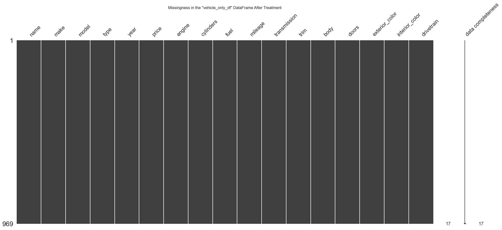
    


## Detection of Outliers


```python
##-- Create functions that visualize quantitative variable distribution --##
def outlier_counter(df, col):  # Counts rows that are determined to be outliers
    lower_quart = np.quantile(df[col], 0.25)
    upper_quart = np.quantile(df[col], 0.75)
    iqr = upper_quart - lower_quart
    lower_threshold = lower_quart - 1.5 * iqr
    upper_threshold = upper_quart + 1.5 * iqr
    outliers = df[(df[col] < lower_threshold) | (df[col] > upper_threshold)]
    return(f'---------- \n Total outliers from {col}: {outliers.shape[0]} \n Percentage of data: {(outliers.shape[0]/df.shape[0])*100}% \n')

def quantitative_visualizer(df, variable):  # Function that visualizes Boxplot and Histogram
    
    median = np.median(df[variable])
    mean = np.mean(df[variable])
    
    fig, ax = plt.subplots(figsize=(10, 3))
    
    ax.hist(df[variable], bins=10)
    ax.set_xlabel(outlier_counter(df, variable))
    
    ax2 = ax.twinx()
    ax2.boxplot(df[variable], vert=False)
    ax2.annotate(f'Median: {median}', xy=(median, 1.10))
    ax2.annotate(f'  Mean: {mean}', xy=(mean, 0.75), color='darkgreen')
    ax2.axvline(x=mean, color='darkgreen', linestyle='--', alpha=0.5)

    ax.set_title(f'Outlier Detection on {variable} Column')
    plt.show()

##-- Create a function that returns the rows considered outliers for a given variable.
def outlier_rows(df, col, threshold='all'):
    lower_quart = np.quantile(df[col], 0.25)
    upper_quart = np.quantile(df[col], 0.75)
    iqr = upper_quart - lower_quart
    lower_threshold = lower_quart - 1.5 * iqr
    upper_threshold = upper_quart + 1.5 * iqr
    
    if threshold == 'all':
        outliers = df[(df[col] < lower_threshold) | (df[col] > upper_threshold)]
    elif threshold == 'lower':
        outliers = df[df[col] < lower_threshold]
    elif threshold == 'upper':
        outliers = df[df[col] > upper_threshold]
        
    return outliers

```


```python
##-- Define quantitative variables --##
cols = [
    'price', 'cylinders', 'mileage', 'doors'
]

##-- Loop to generate visualizations on quantitative variables --##
for var in cols:
    quantitative_visualizer(vehicle_only_df, var)
```


    
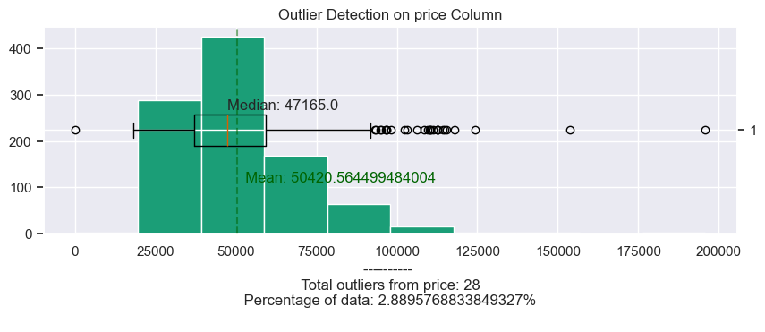
    


    

    


    
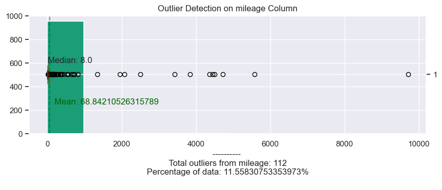
    


    
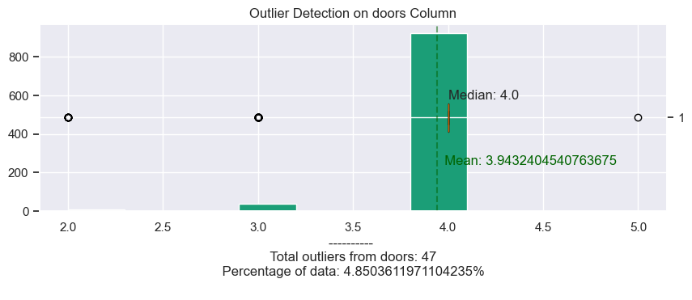
    


**Outliers are found in all 4 quantitative variables:**
- `price` variable: 28 outliers found,
- `cylinders` variable: 104 outliers found,
- `mileage` variable: 112 outliers found, and
- `doors` variable: 47 outliers found.

## Treatment of Outliers
Each variable with outliers will be inspected and a decision to impute, drop, or keep will be made depending on the variable.
### `price` Variable - Outliers
- 28 outliers found.


```python
## Inspect rows that are outliers in price
outlier_df = outlier_rows(vehicle_only_df, 'price')
print(f"## Outlier counts per vehicle model: \n{outlier_df['model'].value_counts()}")
quantitative_visualizer(vehicle_only_df, 'price')
```

    ## Outlier counts per vehicle model: 
    model
    EQS 450           9
    Grand Wagoneer    3
    i7                2
    i5                2
    X7                2
    GLS 450           2
    Yukon XL          1
    Sierra 3500       1
    Sierra 2500       1
    SQ8 e-tron        1
    SQ5               1
    RS e-tron GT      1
    740               1
    3500              1
    Name: count, dtype: int64
    


    

    


- The first impression of the outliers is based on the vehicle model; many vehicles with more than or equal to 2 outliers might be accurate, but other cars with an outlier of 1 might not represent the data. There is also an outlier equal to `0` (zero).
- The distribution of the price variable is right-skewed.

#### Solution:
- The chosen solution is to impute the outlier with a 0 value with a median value of the distribution and then create an additional variable called `price_log` representing the `price` variable as log-transformed.


```python
# Impute variable with price value at `0`
lower_outlier = outlier_rows(vehicle_only_df, 'price', threshold='lower')

# Impute row using the median of the price column.
vehicle_only_df.loc[lower_outlier.index, 'price'] = np.median(vehicle_only_df['price'])

# Visualize imputed row
vehicle_only_df.loc[lower_outlier.index, :]
```


<div>
<style scoped>
    .dataframe tbody tr th:only-of-type {
        vertical-align: middle;
    }

    .dataframe tbody tr th {
        vertical-align: top;
    }

    .dataframe thead th {
        text-align: right;
    }
</style>
<table border="1" class="dataframe">
  <thead>
    <tr style="text-align: right;">
      <th></th>
      <th>name</th>
      <th>make</th>
      <th>model</th>
      <th>type</th>
      <th>year</th>
      <th>price</th>
      <th>engine</th>
      <th>cylinders</th>
      <th>fuel</th>
      <th>mileage</th>
      <th>transmission</th>
      <th>trim</th>
      <th>body</th>
      <th>doors</th>
      <th>exterior_color</th>
      <th>interior_color</th>
      <th>drivetrain</th>
    </tr>
  </thead>
  <tbody>
    <tr>
      <th>94</th>
      <td>2024 Audi SQ5 Premium Plus</td>
      <td>Audi</td>
      <td>SQ5</td>
      <td>New</td>
      <td>2024</td>
      <td>47165.0</td>
      <td>oled Turbo Premium Unleaded V-6 3.0 L/183</td>
      <td>6.0</td>
      <td>Gasoline</td>
      <td>14.0</td>
      <td>Automatic</td>
      <td>Premium Plus</td>
      <td>SUV</td>
      <td>4.0</td>
      <td>Ultra Blue Metallic</td>
      <td>Black</td>
      <td>All-wheel Drive</td>
    </tr>
  </tbody>
</table>
</div>


```python
##-- Create `price_log` variable --##
vehicle_only_df['price_log'] = np.log(vehicle_only_df['price'])

##-- Visualize outliers on transformed variable --##
outlier_df = outlier_rows(vehicle_only_df, 'price_log')
print(f"## Outlier counts per vehicle model (Price Log-transformed): \n{outlier_df['model'].value_counts()}")
quantitative_visualizer(vehicle_only_df, 'price_log')
```

    ## Outlier counts per vehicle model (Price Log-transformed): 
    model
    i7                1
    Versa             1
    RS e-tron GT      1
    Grand Wagoneer    1
    Name: count, dtype: int64
    


    
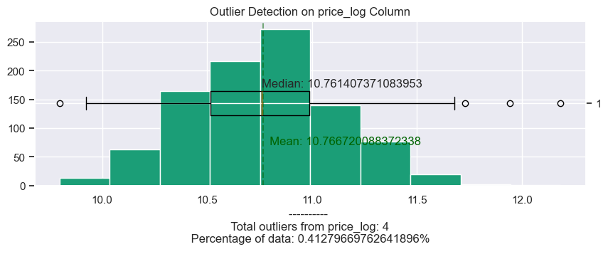
    


- The distribution of the `price_log` variable is less skewed than before.
- The outlier count went from 28 to 4 outliers after the transformation.

### `cylinders` Variable - Outliers
- 104 outliers.


```python
## Inspect rows that are outliers in cylinders
outlier_df = outlier_rows(vehicle_only_df, 'cylinders')
print(f"## Outlier counts per vehicle model: \n{outlier_df['model'].value_counts()}")
quantitative_visualizer(vehicle_only_df, 'cylinders')
```

    ## Outlier counts per vehicle model: 
    model
    IONIQ 5                       26
    Mustang Mach-E                15
    EQS 450                        9
    EV6                            7
    IONIQ 6                        7
    LYRIQ                          5
    Q8 e-tron                      5
    i4 Gran Coupe                  4
    i5                             4
    Prologue                       4
    Blazer EV                      3
    EQE 350+                       2
    i7                             2
    RS e-tron GT                   1
    SQ8 e-tron                     1
    ID.4                           1
    I-PACE                         1
    Equinox EV                     1
    Electrified GV70               1
    Electrified G80                1
    EV9                            1
    Solterra                       1
    ZDX                            1
    C40 Recharge Pure Electric     1
    Name: count, dtype: int64
    


    
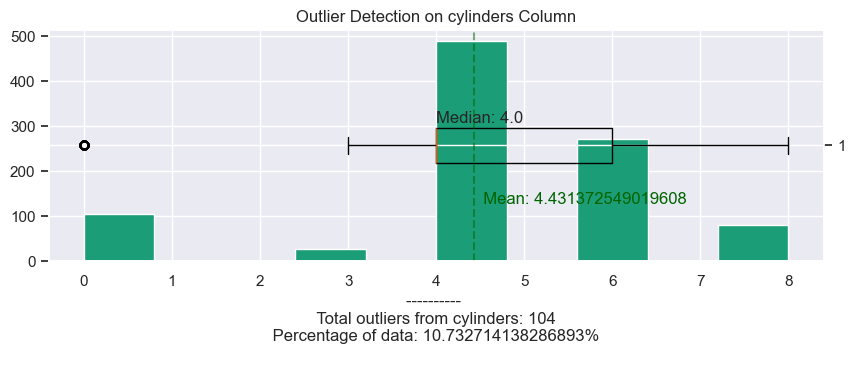
    


- It seems that the outliers for the variable `cylinders` are only found in electric vehicles.
- These outliers are representative of the data and the choice will be to keep them.

### `mileage` Variable - Outliers
- 112 outliers.


```python
## Inspect rows that are outliers in mileage
outlier_df = outlier_rows(vehicle_only_df, 'mileage')
print(f"## Outlier counts per vehicle model: \n{outlier_df['model'].value_counts()}")
quantitative_visualizer(vehicle_only_df, 'mileage')
```

    ## Outlier counts per vehicle model: 
    model
    Durango               18
    3500                  10
    Grand Cherokee 4xe     8
    Hornet                 6
    Edge                   5
    Tucson Hybrid          4
    ProMaster 3500         4
    Jetta                  4
    CX-90 PHEV             4
    Sportage               3
    Taos                   3
    Grand Cherokee L       3
    Expedition             2
    Pacifica               2
    Palisade               2
    Murano                 2
    Grand Wagoneer         2
    X7                     2
    Transit-350            2
    Tucson                 2
    IONIQ 6                2
    CR-V Hybrid            1
    Explorer               1
    F-350                  1
    F-150                  1
    EQE 350+               1
    A3                     1
    Electrified G80        1
    i5                     1
    LYRIQ                  1
    Mustang Mach-E         1
    XT5                    1
    QX50                   1
    Seltos                 1
    Silverado 1500         1
    Silverado 2500         1
    Sprinter 2500          1
    Transit-150            1
    Tundra Hybrid          1
    Wagoneer               1
    Wagoneer L             1
    Wrangler 4xe           1
    Niro                   1
    Name: count, dtype: int64
    


    

    


```python
##-- Inspect outlier observations --##
outlier_rows(vehicle_only_df, 'mileage')
```


<div>
<style scoped>
    .dataframe tbody tr th:only-of-type {
        vertical-align: middle;
    }

    .dataframe tbody tr th {
        vertical-align: top;
    }

    .dataframe thead th {
        text-align: right;
    }
</style>
<table border="1" class="dataframe">
  <thead>
    <tr style="text-align: right;">
      <th></th>
      <th>name</th>
      <th>make</th>
      <th>model</th>
      <th>type</th>
      <th>year</th>
      <th>price</th>
      <th>engine</th>
      <th>cylinders</th>
      <th>fuel</th>
      <th>mileage</th>
      <th>transmission</th>
      <th>trim</th>
      <th>body</th>
      <th>doors</th>
      <th>exterior_color</th>
      <th>interior_color</th>
      <th>drivetrain</th>
      <th>price_log</th>
    </tr>
  </thead>
  <tbody>
    <tr>
      <th>419</th>
      <td>2024 BMW i5 M60</td>
      <td>BMW</td>
      <td>i5</td>
      <td>New</td>
      <td>2024</td>
      <td>96895.0</td>
      <td>c</td>
      <td>0.0</td>
      <td>Electric</td>
      <td>37.0</td>
      <td>1-Speed Automatic</td>
      <td>M60</td>
      <td>Sedan</td>
      <td>4.0</td>
      <td>Black Sapphire</td>
      <td>Black</td>
      <td>All-wheel Drive</td>
      <td>11.481383</td>
    </tr>
    <tr>
      <th>362</th>
      <td>2024 Cadillac XT5 Premium Luxury</td>
      <td>Cadillac</td>
      <td>XT5</td>
      <td>New</td>
      <td>2024</td>
      <td>60915.0</td>
      <td>24V GDI DOHC</td>
      <td>6.0</td>
      <td>Gasoline</td>
      <td>31.0</td>
      <td>9-Speed Automatic</td>
      <td>Premium Luxury</td>
      <td>SUV</td>
      <td>4.0</td>
      <td>Silver Metallic</td>
      <td>Jet Black</td>
      <td>Front-wheel Drive</td>
      <td>11.017235</td>
    </tr>
    <tr>
      <th>450</th>
      <td>2024 BMW X7 M60i</td>
      <td>BMW</td>
      <td>X7</td>
      <td>New</td>
      <td>2024</td>
      <td>115445.0</td>
      <td>32V GDI DOHC Twin Turbo</td>
      <td>8.0</td>
      <td>Gasoline</td>
      <td>447.0</td>
      <td>8-Speed Automatic</td>
      <td>M60i</td>
      <td>SUV</td>
      <td>4.0</td>
      <td>Mineral White Metallic</td>
      <td>Black</td>
      <td>All-wheel Drive</td>
      <td>11.656550</td>
    </tr>
    <tr>
      <th>843</th>
      <td>2024 BMW X7 xDrive40i</td>
      <td>BMW</td>
      <td>X7</td>
      <td>New</td>
      <td>2024</td>
      <td>94895.0</td>
      <td>24V GDI DOHC Turbo</td>
      <td>6.0</td>
      <td>Gasoline</td>
      <td>1946.0</td>
      <td>8-Speed Automatic</td>
      <td>xDrive40i</td>
      <td>SUV</td>
      <td>4.0</td>
      <td>Tanzanite Blue II Metallic</td>
      <td>Silverstone</td>
      <td>All-wheel Drive</td>
      <td>11.460526</td>
    </tr>
    <tr>
      <th>659</th>
      <td>2024 Jeep Wrangler 4xe Rubicon</td>
      <td>Jeep</td>
      <td>Wrangler 4xe</td>
      <td>New</td>
      <td>2024</td>
      <td>65295.0</td>
      <td>16V GDI DOHC Turbo Hybrid</td>
      <td>4.0</td>
      <td>Hybrid</td>
      <td>26.0</td>
      <td>8-Speed Automatic</td>
      <td>Rubicon</td>
      <td>SUV</td>
      <td>4.0</td>
      <td>Hydro Blue Pearlcoat</td>
      <td>Black</td>
      <td>Four-wheel Drive</td>
      <td>11.086671</td>
    </tr>
    <tr>
      <th>...</th>
      <td>...</td>
      <td>...</td>
      <td>...</td>
      <td>...</td>
      <td>...</td>
      <td>...</td>
      <td>...</td>
      <td>...</td>
      <td>...</td>
      <td>...</td>
      <td>...</td>
      <td>...</td>
      <td>...</td>
      <td>...</td>
      <td>...</td>
      <td>...</td>
      <td>...</td>
      <td>...</td>
    </tr>
    <tr>
      <th>639</th>
      <td>2024 RAM 3500 Laramie</td>
      <td>RAM</td>
      <td>3500</td>
      <td>New</td>
      <td>2024</td>
      <td>72294.0</td>
      <td>24V DDI OHV Turbo Diesel</td>
      <td>6.0</td>
      <td>Diesel</td>
      <td>33.0</td>
      <td>Automatic</td>
      <td>Laramie</td>
      <td>Pickup Truck</td>
      <td>4.0</td>
      <td>Diamond Black</td>
      <td>Black</td>
      <td>Four-wheel Drive</td>
      <td>11.188496</td>
    </tr>
    <tr>
      <th>838</th>
      <td>2024 RAM 3500 Big Horn</td>
      <td>RAM</td>
      <td>3500</td>
      <td>New</td>
      <td>2024</td>
      <td>67422.0</td>
      <td>24V DDI OHV Turbo Diesel</td>
      <td>6.0</td>
      <td>Diesel</td>
      <td>27.0</td>
      <td>6-Speed Automatic</td>
      <td>Big Horn</td>
      <td>Pickup Truck</td>
      <td>4.0</td>
      <td>Billet Silver Metallic Clearcoat</td>
      <td>Black</td>
      <td>Four-wheel Drive</td>
      <td>11.118727</td>
    </tr>
    <tr>
      <th>376</th>
      <td>2023 RAM 3500 Tradesman</td>
      <td>RAM</td>
      <td>3500</td>
      <td>New</td>
      <td>2023</td>
      <td>63010.0</td>
      <td>16V MPFI OHV</td>
      <td>8.0</td>
      <td>Gasoline</td>
      <td>95.0</td>
      <td>8-Speed Automatic</td>
      <td>Tradesman</td>
      <td>Pickup Truck</td>
      <td>2.0</td>
      <td>Bright White Clearcoat</td>
      <td>Black</td>
      <td>Four-wheel Drive</td>
      <td>11.051049</td>
    </tr>
    <tr>
      <th>417</th>
      <td>2024 RAM 3500 Tradesman</td>
      <td>RAM</td>
      <td>3500</td>
      <td>New</td>
      <td>2024</td>
      <td>67504.0</td>
      <td>16V MPFI OHV</td>
      <td>8.0</td>
      <td>Gasoline</td>
      <td>98.0</td>
      <td>8-Speed Automatic</td>
      <td>Tradesman</td>
      <td>Pickup Truck</td>
      <td>2.0</td>
      <td>Bright White Clearcoat</td>
      <td>Black</td>
      <td>Four-wheel Drive</td>
      <td>11.119942</td>
    </tr>
    <tr>
      <th>656</th>
      <td>2024 RAM 3500 Tradesman</td>
      <td>RAM</td>
      <td>3500</td>
      <td>New</td>
      <td>2024</td>
      <td>62154.0</td>
      <td>16V MPFI OHV</td>
      <td>8.0</td>
      <td>Gasoline</td>
      <td>197.0</td>
      <td>8-Speed Automatic</td>
      <td>Tradesman</td>
      <td>Pickup Truck</td>
      <td>2.0</td>
      <td>Bright White Clearcoat</td>
      <td>Diesel Gray / Black</td>
      <td>Four-wheel Drive</td>
      <td>11.037370</td>
    </tr>
  </tbody>
</table>
<p>112 rows × 18 columns</p>
</div>


```python
##-- Visualize the distribution of mileage within a subset of the outlier observations --##
mileage_outliers = outlier_rows(vehicle_only_df, 'mileage')
print(mileage_outliers['mileage'].describe())

quantitative_visualizer(mileage_outliers, 'mileage')
```

    count     112.000000
    mean      538.848214
    std      1411.048145
    min        25.000000
    25%        31.000000
    50%        50.000000
    75%       190.250000
    max      9711.000000
    Name: mileage, dtype: float64
    


    
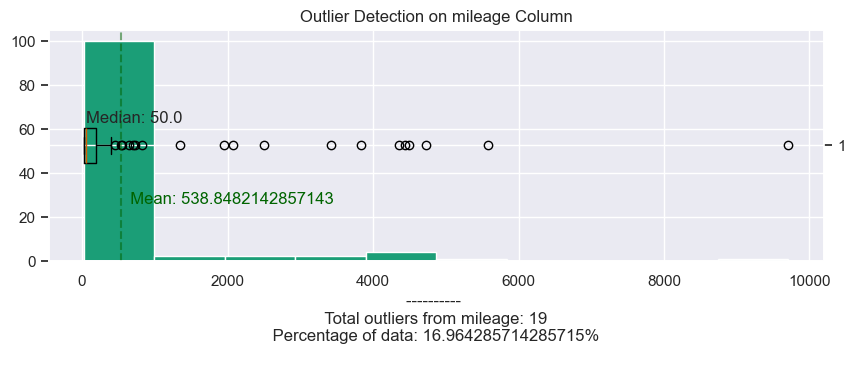
    


```python
##-- Count of outliers between years.
mileage_outliers['year'].value_counts()
```


    year
    2024    83
    2023    29
    Name: count, dtype: int64


- The `mileage` column distribution for the outlier observations is heavily right-skewed, with a significant gap between the mean value of `538.85` and the median value of `50`.

#### Solution:
- When inspecting the mileage distribution for the outlier observations, those within the 0 to 75th percentiles can be expected if these vehicles have had many test drives. Values above the 75% percentile will be dropped.
- 29 vehicles from the year 2023 were discovered. However, this dataset is specifically intended for cars considered `2024`. Therefore, to maintain the dataset's relevance, these 2023 vehicles will be dropped.


```python
## Drop the rows above the 75th percentile from the outlier observations.
outliers_75 = mileage_outliers[mileage_outliers['mileage'] >= 191]
vehicle_only_df.drop(outliers_75.index, axis=0, inplace=True)

# Subset for observations that are for the year of 2024
vehicle_only_df = vehicle_only_df[vehicle_only_df['year'] == 2024]

## Inspect rows that are outliers in mileage after treatment
outlier_df = outlier_rows(vehicle_only_df, 'mileage')
print(f"## Outlier counts per vehicle model after outlier treatment: \n{outlier_df['model'].value_counts()}")
quantitative_visualizer(vehicle_only_df, 'mileage')
```

    ## Outlier counts per vehicle model after outlier treatment: 
    model
    3500                  8
    Grand Cherokee 4xe    7
    Hornet                7
    ProMaster 3500        4
    CX-90 PHEV            4
    Jetta                 4
    Tucson Hybrid         3
    Grand Cherokee L      3
    Taos                  3
    Sportage              3
    Expedition            2
    Palisade              2
    Wagoneer              2
    Silverado 1500        1
    Transit-350           1
    A3                    1
    CR-V Hybrid           1
    Wrangler 4xe          1
    Durango               1
    Edge                  1
    F-350                 1
    Transit-250           1
    QX50                  1
    Transit-150           1
    Sprinter 2500         1
    Murano                1
    Mustang Mach-E        1
    Pacifica              1
    XT5                   1
    Silverado 2500        1
    i5                    1
    Name: count, dtype: int64
    


    
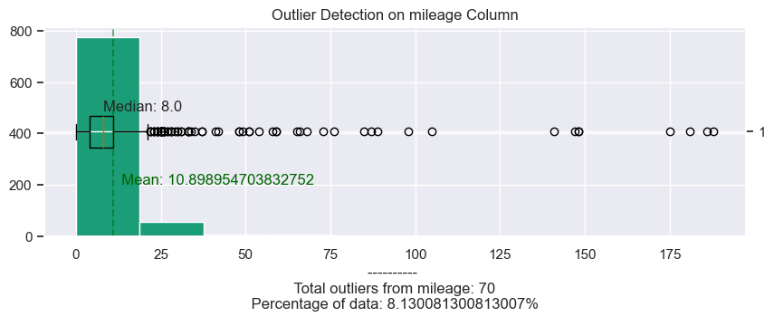
    


- Upon final inspection, the data shows a reduction in outliers from 112 to 70. The outlier values are realistic as vehicles may accumulate additional mileage from test drives, and when dealerships trade cars with each other, vehicle mileage may sometimes increase before a sale.
- The distribution is still heavily right-skewed, but the gap between the mean (`10.9`) and the median (`8`) is significantly lower.

### `doors` Variable - Outliers
- 47 outliers.


```python
## Inspect rows that are outliers in doors
outlier_df = outlier_rows(vehicle_only_df, 'doors')
print(f"## Outlier counts per vehicle model: \n{outlier_df['model'].value_counts()}")
quantitative_visualizer(vehicle_only_df, 'doors')
```

    ## Outlier counts per vehicle model: 
    model
    Transit-250       6
    Sprinter 2500     6
    ProMaster 3500    4
    Savana 2500       3
    ProMaster 2500    3
    Transit-350       2
    Transit-150       2
    Sprinter 3500     2
    Sierra 2500       2
    ProMaster 1500    2
    3500              2
    I-PACE            1
    F-350             1
    Defender          1
    2500              1
    Name: count, dtype: int64
    


    
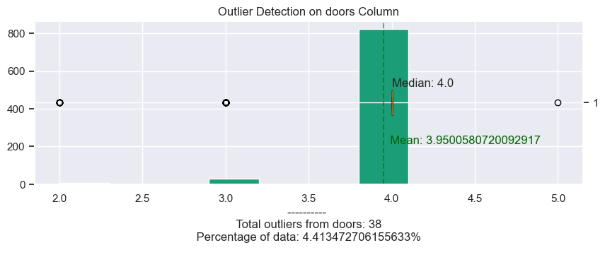
    


```python
# Inspecting 5-door observation.
vehicle_only_df[vehicle_only_df['doors'] == 5]
```


<div>
<style scoped>
    .dataframe tbody tr th:only-of-type {
        vertical-align: middle;
    }

    .dataframe tbody tr th {
        vertical-align: top;
    }

    .dataframe thead th {
        text-align: right;
    }
</style>
<table border="1" class="dataframe">
  <thead>
    <tr style="text-align: right;">
      <th></th>
      <th>name</th>
      <th>make</th>
      <th>model</th>
      <th>type</th>
      <th>year</th>
      <th>price</th>
      <th>engine</th>
      <th>cylinders</th>
      <th>fuel</th>
      <th>mileage</th>
      <th>transmission</th>
      <th>trim</th>
      <th>body</th>
      <th>doors</th>
      <th>exterior_color</th>
      <th>interior_color</th>
      <th>drivetrain</th>
      <th>price_log</th>
    </tr>
  </thead>
  <tbody>
    <tr>
      <th>726</th>
      <td>2024 Jaguar I-PACE EV400 R-Dynamic HSE</td>
      <td>Jaguar</td>
      <td>I-PACE</td>
      <td>New</td>
      <td>2024</td>
      <td>77053.0</td>
      <td>d&gt;\n\n    \n    &lt;dt&gt;VIN&lt;/dt&gt;\n     SADHM2S12R1...</td>
      <td>0.0</td>
      <td>Electric</td>
      <td>8.0</td>
      <td>Automatic</td>
      <td>EV400 R-Dynamic HSE</td>
      <td>SUV</td>
      <td>5.0</td>
      <td>Santorini Black</td>
      <td>Ebony</td>
      <td>All-wheel Drive</td>
      <td>11.252249</td>
    </tr>
  </tbody>
</table>
</div>


```python
# Inspecting 3-door observation.
vehicle_only_df[vehicle_only_df['doors'] == 3]
```


<div>
<style scoped>
    .dataframe tbody tr th:only-of-type {
        vertical-align: middle;
    }

    .dataframe tbody tr th {
        vertical-align: top;
    }

    .dataframe thead th {
        text-align: right;
    }
</style>
<table border="1" class="dataframe">
  <thead>
    <tr style="text-align: right;">
      <th></th>
      <th>name</th>
      <th>make</th>
      <th>model</th>
      <th>type</th>
      <th>year</th>
      <th>price</th>
      <th>engine</th>
      <th>cylinders</th>
      <th>fuel</th>
      <th>mileage</th>
      <th>transmission</th>
      <th>trim</th>
      <th>body</th>
      <th>doors</th>
      <th>exterior_color</th>
      <th>interior_color</th>
      <th>drivetrain</th>
      <th>price_log</th>
    </tr>
  </thead>
  <tbody>
    <tr>
      <th>897</th>
      <td>2024 Ford Transit-350 Base</td>
      <td>Ford</td>
      <td>Transit-350</td>
      <td>New</td>
      <td>2024</td>
      <td>74391.0</td>
      <td>6 port/direct injection, DOHC, variable valve ...</td>
      <td>6.0</td>
      <td>Gasoline</td>
      <td>85.0</td>
      <td>Automatic</td>
      <td>Base</td>
      <td>Cargo Van</td>
      <td>3.0</td>
      <td>Oxford White</td>
      <td>gray</td>
      <td>All-wheel Drive</td>
      <td>11.217090</td>
    </tr>
    <tr>
      <th>940</th>
      <td>2024 Ford Transit-350 148 WB Medium Roof Cargo</td>
      <td>Ford</td>
      <td>Transit-350</td>
      <td>New</td>
      <td>2024</td>
      <td>52530.0</td>
      <td>24V PDI DOHC Flexible Fuel</td>
      <td>6.0</td>
      <td>E85 Flex Fuel</td>
      <td>1.0</td>
      <td>Automatic</td>
      <td>148 WB Medium Roof Cargo</td>
      <td>Cargo Van</td>
      <td>3.0</td>
      <td>White</td>
      <td>Black</td>
      <td>Rear-wheel Drive</td>
      <td>10.869140</td>
    </tr>
    <tr>
      <th>412</th>
      <td>2024 Ford Transit-250 Base</td>
      <td>Ford</td>
      <td>Transit-250</td>
      <td>New</td>
      <td>2024</td>
      <td>51803.0</td>
      <td>6 port/direct injection, DOHC, variable valve ...</td>
      <td>6.0</td>
      <td>Gasoline</td>
      <td>1.0</td>
      <td>Automatic</td>
      <td>Base</td>
      <td>Cargo Van</td>
      <td>3.0</td>
      <td>Oxford White</td>
      <td>Dk Palazzo Gry Fron</td>
      <td>Rear-wheel Drive</td>
      <td>10.855203</td>
    </tr>
    <tr>
      <th>472</th>
      <td>2024 Ford Transit-250 Base</td>
      <td>Ford</td>
      <td>Transit-250</td>
      <td>New</td>
      <td>2024</td>
      <td>52853.0</td>
      <td>6 port/direct injection, DOHC, variable valve ...</td>
      <td>6.0</td>
      <td>Gasoline</td>
      <td>0.0</td>
      <td>Automatic</td>
      <td>Base</td>
      <td>Cargo Van</td>
      <td>3.0</td>
      <td>Oxford White</td>
      <td>Dk Palazzo Gry Fron</td>
      <td>Rear-wheel Drive</td>
      <td>10.875270</td>
    </tr>
    <tr>
      <th>581</th>
      <td>2024 Ford Transit-250 Base</td>
      <td>Ford</td>
      <td>Transit-250</td>
      <td>New</td>
      <td>2024</td>
      <td>61248.0</td>
      <td>6 port/direct injection, DOHC, variable valve ...</td>
      <td>6.0</td>
      <td>Gasoline</td>
      <td>0.0</td>
      <td>Automatic</td>
      <td>Base</td>
      <td>Cargo Van</td>
      <td>3.0</td>
      <td>Oxford White</td>
      <td>Gray</td>
      <td>Rear-wheel Drive</td>
      <td>11.022686</td>
    </tr>
    <tr>
      <th>831</th>
      <td>2024 Ford Transit-250 Base</td>
      <td>Ford</td>
      <td>Transit-250</td>
      <td>New</td>
      <td>2024</td>
      <td>64025.0</td>
      <td>6 port/direct injection, DOHC, variable valve ...</td>
      <td>6.0</td>
      <td>Gasoline</td>
      <td>0.0</td>
      <td>Automatic</td>
      <td>Base</td>
      <td>Cargo Van</td>
      <td>3.0</td>
      <td>Oxford White</td>
      <td>Dk Palazzo Gry Clth Front</td>
      <td>All-wheel Drive</td>
      <td>11.067029</td>
    </tr>
    <tr>
      <th>31</th>
      <td>2024 Ford Transit-250 148 WB Medium Roof Cargo</td>
      <td>Ford</td>
      <td>Transit-250</td>
      <td>New</td>
      <td>2024</td>
      <td>53595.0</td>
      <td>24V PDI DOHC Flexible Fuel</td>
      <td>6.0</td>
      <td>E85 Flex Fuel</td>
      <td>10.0</td>
      <td>Automatic</td>
      <td>148 WB Medium Roof Cargo</td>
      <td>Cargo Van</td>
      <td>3.0</td>
      <td>Oxford White</td>
      <td>Dark Palazzo Gray</td>
      <td>Rear-wheel Drive</td>
      <td>10.889211</td>
    </tr>
    <tr>
      <th>909</th>
      <td>2024 Ford Transit-250 148 WB Medium Roof Cargo</td>
      <td>Ford</td>
      <td>Transit-250</td>
      <td>New</td>
      <td>2024</td>
      <td>50486.0</td>
      <td>24V PDI DOHC Flexible Fuel</td>
      <td>6.0</td>
      <td>E85 Flex Fuel</td>
      <td>24.0</td>
      <td>10-Speed Automatic with Overdrive</td>
      <td>148 WB Medium Roof Cargo</td>
      <td>Cargo Van</td>
      <td>3.0</td>
      <td>Oxford White</td>
      <td>Dark Palazzo</td>
      <td>Rear-wheel Drive</td>
      <td>10.829451</td>
    </tr>
    <tr>
      <th>115</th>
      <td>2024 Ford Transit-150 Base</td>
      <td>Ford</td>
      <td>Transit-150</td>
      <td>New</td>
      <td>2024</td>
      <td>55645.0</td>
      <td>24V PDI DOHC Flexible Fuel</td>
      <td>6.0</td>
      <td>E85 Flex Fuel</td>
      <td>59.0</td>
      <td>10-Speed Automatic</td>
      <td>Base</td>
      <td>Cargo Van</td>
      <td>3.0</td>
      <td>Race Red</td>
      <td>Ebony</td>
      <td>All-wheel Drive</td>
      <td>10.926748</td>
    </tr>
    <tr>
      <th>877</th>
      <td>2024 Ford Transit-150 Base</td>
      <td>Ford</td>
      <td>Transit-150</td>
      <td>New</td>
      <td>2024</td>
      <td>52640.0</td>
      <td>24V PDI DOHC Flexible Fuel</td>
      <td>6.0</td>
      <td>E85 Flex Fuel</td>
      <td>6.0</td>
      <td>10-Speed Automatic</td>
      <td>Base</td>
      <td>Cargo Van</td>
      <td>3.0</td>
      <td>Oxford White</td>
      <td>Gray</td>
      <td>Rear-wheel Drive</td>
      <td>10.871232</td>
    </tr>
    <tr>
      <th>676</th>
      <td>2024 Mercedes-Benz Sprinter 3500 High Roof</td>
      <td>Mercedes-Benz</td>
      <td>Sprinter 3500</td>
      <td>New</td>
      <td>2024</td>
      <td>62295.0</td>
      <td>diesel direct injection, DOHC, intercooled tur...</td>
      <td>4.0</td>
      <td>Diesel</td>
      <td>8.0</td>
      <td>Automatic</td>
      <td>High Roof</td>
      <td>Cargo Van</td>
      <td>3.0</td>
      <td>Iridium Silver</td>
      <td>Black</td>
      <td>Rear-wheel Drive</td>
      <td>11.039636</td>
    </tr>
    <tr>
      <th>350</th>
      <td>2024 Mercedes-Benz Sprinter 3500 170 WB High R...</td>
      <td>Mercedes-Benz</td>
      <td>Sprinter 3500</td>
      <td>New</td>
      <td>2024</td>
      <td>72357.0</td>
      <td>16V DDI DOHC Turbo Diesel</td>
      <td>4.0</td>
      <td>Diesel</td>
      <td>9.0</td>
      <td>9-Speed Automatic</td>
      <td>170 WB High Roof Extended Cargo</td>
      <td>Cargo Van</td>
      <td>3.0</td>
      <td>Gray White</td>
      <td>Black</td>
      <td>Rear-wheel Drive</td>
      <td>11.189367</td>
    </tr>
    <tr>
      <th>612</th>
      <td>2024 Mercedes-Benz Sprinter 2500 High Roof</td>
      <td>Mercedes-Benz</td>
      <td>Sprinter 2500</td>
      <td>New</td>
      <td>2024</td>
      <td>65129.0</td>
      <td>diesel direct injection, DOHC, intercooled tur...</td>
      <td>4.0</td>
      <td>Diesel</td>
      <td>0.0</td>
      <td>Automatic</td>
      <td>High Roof</td>
      <td>Pickup Truck</td>
      <td>3.0</td>
      <td>Bright White Clearcoat</td>
      <td>Black</td>
      <td>Rear-wheel Drive</td>
      <td>11.084125</td>
    </tr>
    <tr>
      <th>741</th>
      <td>2024 Mercedes-Benz Sprinter 2500 Crew 144 WB</td>
      <td>Mercedes-Benz</td>
      <td>Sprinter 2500</td>
      <td>New</td>
      <td>2024</td>
      <td>66902.0</td>
      <td>diesel direct injection, DOHC, intercooled tur...</td>
      <td>4.0</td>
      <td>Diesel</td>
      <td>10.0</td>
      <td>Automatic</td>
      <td>Crew 144 WB</td>
      <td>Cargo Van</td>
      <td>3.0</td>
      <td>Gray</td>
      <td>Black</td>
      <td>Rear-wheel Drive</td>
      <td>11.110984</td>
    </tr>
    <tr>
      <th>107</th>
      <td>2024 Mercedes-Benz Sprinter 2500 Standard Roof</td>
      <td>Mercedes-Benz</td>
      <td>Sprinter 2500</td>
      <td>New</td>
      <td>2024</td>
      <td>60061.0</td>
      <td>16V DDI DOHC Turbo Diesel</td>
      <td>4.0</td>
      <td>Diesel</td>
      <td>58.0</td>
      <td>9-Speed Automatic</td>
      <td>Standard Roof</td>
      <td>Cargo Van</td>
      <td>3.0</td>
      <td>Silver Gray</td>
      <td>Black</td>
      <td>Rear-wheel Drive</td>
      <td>11.003116</td>
    </tr>
    <tr>
      <th>842</th>
      <td>2024 Mercedes-Benz Sprinter 2500 144 WB Standa...</td>
      <td>Mercedes-Benz</td>
      <td>Sprinter 2500</td>
      <td>New</td>
      <td>2024</td>
      <td>61276.0</td>
      <td>16V DDI DOHC Turbo Diesel</td>
      <td>4.0</td>
      <td>Diesel</td>
      <td>10.0</td>
      <td>9-Speed Automatic</td>
      <td>144 WB Standard Roof Crew</td>
      <td>Cargo Van</td>
      <td>3.0</td>
      <td>Arctic White</td>
      <td>Black</td>
      <td>Rear-wheel Drive</td>
      <td>11.023144</td>
    </tr>
    <tr>
      <th>864</th>
      <td>2024 Mercedes-Benz Sprinter 2500 144 WB Standa...</td>
      <td>Mercedes-Benz</td>
      <td>Sprinter 2500</td>
      <td>New</td>
      <td>2024</td>
      <td>69017.0</td>
      <td>16V DDI DOHC Turbo Diesel</td>
      <td>4.0</td>
      <td>Diesel</td>
      <td>10.0</td>
      <td>9-Speed Automatic</td>
      <td>144 WB Standard Roof Passenger</td>
      <td>Passenger Van</td>
      <td>3.0</td>
      <td>Jet Black</td>
      <td>Black</td>
      <td>Rear-wheel Drive</td>
      <td>11.142108</td>
    </tr>
    <tr>
      <th>997</th>
      <td>2024 Mercedes-Benz Sprinter 2500 Standard Roof</td>
      <td>Mercedes-Benz</td>
      <td>Sprinter 2500</td>
      <td>New</td>
      <td>2024</td>
      <td>59037.0</td>
      <td>16V DDI DOHC Turbo Diesel</td>
      <td>4.0</td>
      <td>Diesel</td>
      <td>10.0</td>
      <td>9-Speed Automatic</td>
      <td>Standard Roof</td>
      <td>Cargo Van</td>
      <td>3.0</td>
      <td>Arctic White</td>
      <td>Black</td>
      <td>Rear-wheel Drive</td>
      <td>10.985920</td>
    </tr>
    <tr>
      <th>134</th>
      <td>2024 GMC Savana 2500 Work Van</td>
      <td>GMC</td>
      <td>Savana 2500</td>
      <td>New</td>
      <td>2024</td>
      <td>44595.0</td>
      <td>6 gasoline direct injection, variable valve co...</td>
      <td>6.0</td>
      <td>Gasoline</td>
      <td>3.0</td>
      <td>Automatic</td>
      <td>Work Van</td>
      <td>Cargo Van</td>
      <td>3.0</td>
      <td>Summit White</td>
      <td>Black</td>
      <td>Rear-wheel Drive</td>
      <td>10.705377</td>
    </tr>
    <tr>
      <th>169</th>
      <td>2024 GMC Savana 2500 Work Van</td>
      <td>GMC</td>
      <td>Savana 2500</td>
      <td>New</td>
      <td>2024</td>
      <td>44620.0</td>
      <td>6 gasoline direct injection, variable valve co...</td>
      <td>6.0</td>
      <td>Gasoline</td>
      <td>12.0</td>
      <td>Automatic</td>
      <td>Work Van</td>
      <td>Cargo Van</td>
      <td>3.0</td>
      <td>SILVER</td>
      <td>Black</td>
      <td>Rear-wheel Drive</td>
      <td>10.705937</td>
    </tr>
    <tr>
      <th>378</th>
      <td>2024 GMC Savana 2500 Work Van</td>
      <td>GMC</td>
      <td>Savana 2500</td>
      <td>New</td>
      <td>2024</td>
      <td>42990.0</td>
      <td>12V GDI OHV</td>
      <td>6.0</td>
      <td>Gasoline</td>
      <td>0.0</td>
      <td>8-Speed Automatic</td>
      <td>Work Van</td>
      <td>Cargo Van</td>
      <td>3.0</td>
      <td>Summit White</td>
      <td>Medium Pewter</td>
      <td>Rear-wheel Drive</td>
      <td>10.668723</td>
    </tr>
    <tr>
      <th>152</th>
      <td>2024 RAM ProMaster 3500 High Roof</td>
      <td>RAM</td>
      <td>ProMaster 3500</td>
      <td>New</td>
      <td>2024</td>
      <td>53099.0</td>
      <td>24V MPFI DOHC</td>
      <td>6.0</td>
      <td>Gasoline</td>
      <td>30.0</td>
      <td>9-Speed Automatic</td>
      <td>High Roof</td>
      <td>Cargo Van</td>
      <td>3.0</td>
      <td>Bright White Clearcoat</td>
      <td>Black</td>
      <td>Front-wheel Drive</td>
      <td>10.879913</td>
    </tr>
    <tr>
      <th>600</th>
      <td>2024 RAM ProMaster 3500 Base</td>
      <td>RAM</td>
      <td>ProMaster 3500</td>
      <td>New</td>
      <td>2024</td>
      <td>67749.0</td>
      <td>24V MPFI DOHC</td>
      <td>6.0</td>
      <td>Gasoline</td>
      <td>181.0</td>
      <td>9-Speed Automatic</td>
      <td>Base</td>
      <td>Cargo Van</td>
      <td>3.0</td>
      <td>Bright White Clearcoat</td>
      <td>Black</td>
      <td>Front-wheel Drive</td>
      <td>11.123565</td>
    </tr>
    <tr>
      <th>633</th>
      <td>2024 RAM ProMaster 3500 Base</td>
      <td>RAM</td>
      <td>ProMaster 3500</td>
      <td>New</td>
      <td>2024</td>
      <td>68095.0</td>
      <td>24V MPFI DOHC</td>
      <td>6.0</td>
      <td>Gasoline</td>
      <td>186.0</td>
      <td>9-Speed Automatic</td>
      <td>Base</td>
      <td>Cargo Van</td>
      <td>3.0</td>
      <td>Bright White Clearcoat</td>
      <td>Black</td>
      <td>Front-wheel Drive</td>
      <td>11.128659</td>
    </tr>
    <tr>
      <th>667</th>
      <td>2024 RAM ProMaster 3500 Base</td>
      <td>RAM</td>
      <td>ProMaster 3500</td>
      <td>New</td>
      <td>2024</td>
      <td>68095.0</td>
      <td>24V MPFI DOHC</td>
      <td>6.0</td>
      <td>Gasoline</td>
      <td>188.0</td>
      <td>9-Speed Automatic</td>
      <td>Base</td>
      <td>Cargo Van</td>
      <td>3.0</td>
      <td>Bright White Clearcoat</td>
      <td>Black</td>
      <td>Front-wheel Drive</td>
      <td>11.128659</td>
    </tr>
    <tr>
      <th>132</th>
      <td>2024 RAM ProMaster 2500 High Roof</td>
      <td>RAM</td>
      <td>ProMaster 2500</td>
      <td>New</td>
      <td>2024</td>
      <td>53272.0</td>
      <td>24V MPFI DOHC</td>
      <td>6.0</td>
      <td>Gasoline</td>
      <td>1.0</td>
      <td>9-Speed Automatic</td>
      <td>High Roof</td>
      <td>Cargo Van</td>
      <td>3.0</td>
      <td>Bright White Clearcoat</td>
      <td>Black</td>
      <td>Front-wheel Drive</td>
      <td>10.883166</td>
    </tr>
    <tr>
      <th>267</th>
      <td>2024 RAM ProMaster 2500 High Roof</td>
      <td>RAM</td>
      <td>ProMaster 2500</td>
      <td>New</td>
      <td>2024</td>
      <td>53445.0</td>
      <td>24V MPFI DOHC</td>
      <td>6.0</td>
      <td>Gasoline</td>
      <td>6.0</td>
      <td>9-Speed Automatic</td>
      <td>High Roof</td>
      <td>Cargo Van</td>
      <td>3.0</td>
      <td>Bright Silver Clearcoat Metallic</td>
      <td>Black</td>
      <td>Front-wheel Drive</td>
      <td>10.886408</td>
    </tr>
    <tr>
      <th>389</th>
      <td>2024 RAM ProMaster 2500 High Roof</td>
      <td>RAM</td>
      <td>ProMaster 2500</td>
      <td>New</td>
      <td>2024</td>
      <td>53890.0</td>
      <td>24V MPFI DOHC</td>
      <td>6.0</td>
      <td>Gasoline</td>
      <td>3.0</td>
      <td>9-Speed Automatic</td>
      <td>High Roof</td>
      <td>Cargo Van</td>
      <td>3.0</td>
      <td>Bright White Clearcoat</td>
      <td>Black</td>
      <td>Front-wheel Drive</td>
      <td>10.894700</td>
    </tr>
    <tr>
      <th>935</th>
      <td>2024 RAM ProMaster 1500 Low Roof</td>
      <td>RAM</td>
      <td>ProMaster 1500</td>
      <td>New</td>
      <td>2024</td>
      <td>51380.0</td>
      <td>24V MPFI DOHC</td>
      <td>6.0</td>
      <td>Gasoline</td>
      <td>10.0</td>
      <td>9-Speed Automatic</td>
      <td>Low Roof</td>
      <td>Cargo Van</td>
      <td>3.0</td>
      <td>Bright White Clearcoat</td>
      <td>Black</td>
      <td>Front-wheel Drive</td>
      <td>10.847004</td>
    </tr>
    <tr>
      <th>984</th>
      <td>2024 RAM ProMaster 1500 Low Roof</td>
      <td>RAM</td>
      <td>ProMaster 1500</td>
      <td>New</td>
      <td>2024</td>
      <td>48822.0</td>
      <td>24V MPFI DOHC</td>
      <td>6.0</td>
      <td>Gasoline</td>
      <td>12.0</td>
      <td>9-Speed Automatic</td>
      <td>Low Roof</td>
      <td>Cargo Van</td>
      <td>3.0</td>
      <td>Bright White Clearcoat</td>
      <td>Black</td>
      <td>Front-wheel Drive</td>
      <td>10.795936</td>
    </tr>
  </tbody>
</table>
</div>


```python
# Inspecting 2-door observation.
vehicle_only_df[vehicle_only_df['doors'] == 2]
```


<div>
<style scoped>
    .dataframe tbody tr th:only-of-type {
        vertical-align: middle;
    }

    .dataframe tbody tr th {
        vertical-align: top;
    }

    .dataframe thead th {
        text-align: right;
    }
</style>
<table border="1" class="dataframe">
  <thead>
    <tr style="text-align: right;">
      <th></th>
      <th>name</th>
      <th>make</th>
      <th>model</th>
      <th>type</th>
      <th>year</th>
      <th>price</th>
      <th>engine</th>
      <th>cylinders</th>
      <th>fuel</th>
      <th>mileage</th>
      <th>transmission</th>
      <th>trim</th>
      <th>body</th>
      <th>doors</th>
      <th>exterior_color</th>
      <th>interior_color</th>
      <th>drivetrain</th>
      <th>price_log</th>
    </tr>
  </thead>
  <tbody>
    <tr>
      <th>745</th>
      <td>2024 GMC Sierra 2500 Pro</td>
      <td>GMC</td>
      <td>Sierra 2500</td>
      <td>New</td>
      <td>2024</td>
      <td>47763.0</td>
      <td>16V GDI OHV</td>
      <td>8.0</td>
      <td>Gasoline</td>
      <td>0.0</td>
      <td>10-Speed Automatic</td>
      <td>Pro</td>
      <td>Pickup Truck</td>
      <td>2.0</td>
      <td>Summit White</td>
      <td>Jet Black</td>
      <td>Rear-wheel Drive</td>
      <td>10.774007</td>
    </tr>
    <tr>
      <th>955</th>
      <td>2024 GMC Sierra 2500 Pro</td>
      <td>GMC</td>
      <td>Sierra 2500</td>
      <td>New</td>
      <td>2024</td>
      <td>48268.0</td>
      <td>16V GDI OHV</td>
      <td>8.0</td>
      <td>Gasoline</td>
      <td>3.0</td>
      <td>10-Speed Automatic</td>
      <td>Pro</td>
      <td>Pickup Truck</td>
      <td>2.0</td>
      <td>Summit White</td>
      <td>Jet Black</td>
      <td>Rear-wheel Drive</td>
      <td>10.784524</td>
    </tr>
    <tr>
      <th>172</th>
      <td>2024 Ford F-350 XL</td>
      <td>Ford</td>
      <td>F-350</td>
      <td>New</td>
      <td>2024</td>
      <td>52263.0</td>
      <td>8 variable valve control, regular unleaded, en...</td>
      <td>8.0</td>
      <td>Gasoline</td>
      <td>10.0</td>
      <td>10-Speed Automatic</td>
      <td>XL</td>
      <td>Pickup Truck</td>
      <td>2.0</td>
      <td>Race Red</td>
      <td>Medium Earth Gray</td>
      <td>Four-wheel Drive</td>
      <td>10.864044</td>
    </tr>
    <tr>
      <th>440</th>
      <td>2024 Land Rover Defender P400 X-Dynamic SE</td>
      <td>Land Rover</td>
      <td>Defender</td>
      <td>New</td>
      <td>2024</td>
      <td>77645.0</td>
      <td>24V GDI DOHC Turbo</td>
      <td>6.0</td>
      <td>Gasoline</td>
      <td>9.0</td>
      <td>8-Speed Automatic</td>
      <td>P400 X-Dynamic SE</td>
      <td>SUV</td>
      <td>2.0</td>
      <td>Gondwana Stone</td>
      <td>Ebony</td>
      <td>Four-wheel Drive</td>
      <td>11.259902</td>
    </tr>
    <tr>
      <th>619</th>
      <td>2024 RAM 3500 Tradesman</td>
      <td>RAM</td>
      <td>3500</td>
      <td>New</td>
      <td>2024</td>
      <td>61330.0</td>
      <td>24V DDI OHV Turbo Diesel</td>
      <td>6.0</td>
      <td>Diesel</td>
      <td>6.0</td>
      <td>6-Speed Automatic</td>
      <td>Tradesman</td>
      <td>Pickup Truck</td>
      <td>2.0</td>
      <td>Flame Red Clearcoat</td>
      <td>Black</td>
      <td>Four-wheel Drive</td>
      <td>11.024024</td>
    </tr>
    <tr>
      <th>417</th>
      <td>2024 RAM 3500 Tradesman</td>
      <td>RAM</td>
      <td>3500</td>
      <td>New</td>
      <td>2024</td>
      <td>67504.0</td>
      <td>16V MPFI OHV</td>
      <td>8.0</td>
      <td>Gasoline</td>
      <td>98.0</td>
      <td>8-Speed Automatic</td>
      <td>Tradesman</td>
      <td>Pickup Truck</td>
      <td>2.0</td>
      <td>Bright White Clearcoat</td>
      <td>Black</td>
      <td>Four-wheel Drive</td>
      <td>11.119942</td>
    </tr>
    <tr>
      <th>921</th>
      <td>2024 RAM 2500 Tradesman Regular Cab 4x4 8' Box</td>
      <td>RAM</td>
      <td>2500</td>
      <td>New</td>
      <td>2024</td>
      <td>53750.0</td>
      <td>4L V-8 VVT variable valve control, regular unl...</td>
      <td>8.0</td>
      <td>Gasoline</td>
      <td>0.0</td>
      <td>Automatic</td>
      <td>Tradesman Regular Cab 4x4 8&amp;#39; Box</td>
      <td>Pickup Truck</td>
      <td>2.0</td>
      <td>Bright White Clearcoat</td>
      <td>Diesel Gray/Black</td>
      <td>Four-wheel Drive</td>
      <td>10.892099</td>
    </tr>
  </tbody>
</table>
</div>


- The 2-door and 3-door vehicles are accurate to the model.

#### Solution:
- The only false outlier observed is the 5-door observation, which is a 4-door vehicle; that variable will be adjusted accordingly.


```python
# Correct value
vehicle_only_df.loc[726, 'doors'] = 4

## Inspect rows that are outliers in doors
outlier_df = outlier_rows(vehicle_only_df, 'doors')
print(f"## Outlier counts per vehicle model: \n{outlier_df['model'].value_counts()}")
quantitative_visualizer(vehicle_only_df, 'doors')
```

    ## Outlier counts per vehicle model: 
    model
    Transit-250       6
    Sprinter 2500     6
    ProMaster 3500    4
    Savana 2500       3
    ProMaster 2500    3
    Transit-350       2
    Transit-150       2
    Sprinter 3500     2
    Sierra 2500       2
    ProMaster 1500    2
    3500              2
    F-350             1
    Defender          1
    2500              1
    Name: count, dtype: int64
    


    
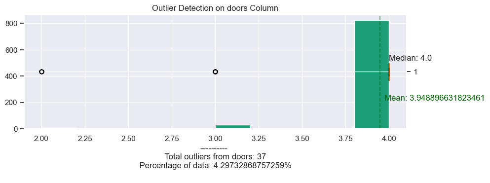
    


- The distribution of the doors variable is heavily left-skewed.


```python

```
